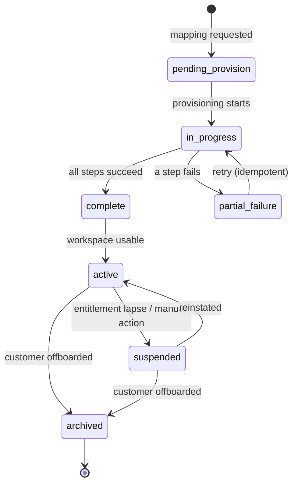

# Ascend OS v1 — Architecture Specification
### The Autonomous Growth Operating System

**Canonical location:** `docs/architecture/ASCEND_OS_V1_ARCHITECTURE_SPECIFICATION.md` in `DivineXLeadStack` (this file). The Ascend Intelligence repo (`DivineX-Business-Intelligence`) holds only a pointer at `docs/ASCEND_OS_V1_ARCHITECTURE_REFERENCE.md` — no second editable copy exists.

**Status:** Section 1 (Locked Architecture Decisions) is approved and binding. **Phase 0 (repository verification) is now substantially complete** — see Section 0. Sections 2–13 are the **Phase 1 planning draft** carried forward from the prior revision: reasoned, now partially fact-checked against Phase 0 findings (corrections are called out inline), but **not yet product-owner approved** and not yet implementation work.

**This revision's scope:** Phase 0 verification only — validate prior claims against live repository source, document the SSO bridge fully in both repos, label evidence, correct or confirm the Phase 1 draft's assumptions where verification touched them, produce the manual live-test checklist. **No code was written or modified in either product application. No auth, routing, workspace, or Zeno-execution behavior changed.** (The only files touched by this pass are documentation: this file, `DivineX-Business-Intelligence/docs/SSO_BRIDGE.md`, `DivineX-Business-Intelligence/docs/ASCEND_OS_V1_ARCHITECTURE_REFERENCE.md`, and a new SSO section in this repo's `CLAUDE.md`.)

**Evidence key:**
- ✅ **VERIFIED** — confirmed by direct inspection of the live repository source (not inferred from comments or docs)
- 🟡 **PARTIALLY VERIFIED** — the core claim holds but a material detail was wrong or incomplete
- ❌ **INCORRECT** — the claim as previously stated does not match the code
- ⬜ **MISSING** — not previously documented anywhere; confirmed present in code during this pass
- 🆕 **NEW FINDING** — not anticipated by any prior draft; surfaced during this verification pass
- 🔒 **LOCKED** — product-owner decision; architecture must support it, not re-litigate it
- 🧭 **RECOMMENDATION** — reasoned, not yet implemented or approved
- ❓ **OPEN** — unresolved, requires a product-owner decision

---

## 0. Phase 0 — Verified Repository Findings

This section replaces the prior revision's verification template with real findings from direct inspection of both repositories: `DivineXLeadStack` (Flow, this repo) and `DivineX-Business-Intelligence` (Ascend Intelligence, at `/Users/boss/DivineX-Business-Intelligence` — note the actual directory name differs from the `DivineX-Ascend1` name used in some planning conversations; this document uses the real path throughout).

### 0.1 SSO Bridge — fully documented ✅

**Full documentation now lives in both repos:**
- Flow side: this repo's `CLAUDE.md`, section **"Ascend SSO Bridge (Ascend → Flow, v1)"** — five-phase flow, token formats, security properties, known limitations, env vars.
- Ascend side: `DivineX-Business-Intelligence/docs/SSO_BRIDGE.md` — the Ascend-side routes, the `divinex_workspace_mappings` data model, env vars, and the third (non-SSO) integration described below.

**Headline finding: the bridge is real, working, and fully built for V1** — not a stub, not partially implemented. It was simply **undocumented in both repos until this pass** — confirmed by grep across all of Flow's `CLAUDE.md` (zero SSO mentions before this revision) and by the Ascend agent finding no equivalent doc in that repo either.

| Item | Status |
|---|---|
| SSO routes exist and are wired (`/api/auth/sso/callback`, `/api/auth/sso/exchange-bridge-token`, `/auth/sso/finish`, Ascend's `/api/sso/operations/{start,exchange}`) | ✅ VERIFIED — read all five route/lib files directly |
| Token/cookie exchange flow (5 phases: start → callback → exchange → workspace-auth+bridge → finish) | ✅ VERIFIED — line-level, both sides |
| Workspace authorization behavior (`verifySsoWorkspaceAccess()`, fail-closed on role mismatch, re-run twice) | ✅ VERIFIED |
| JIT provisioning behavior | ✅ VERIFIED — gated by Ascend's `provisioningAllowed` flag on the workspace-mapping row; creates Firebase user + 3 Firestore docs, rolled back atomically on partial failure |
| Session creation (Firebase custom-token → session cookie) | ✅ VERIFIED — reuses the exact `createSessionCookie()` path the native login form uses, no parallel logic |
| Replay protection | ✅ VERIFIED — auth code: 90s TTL, atomic SQL consume. Bridge token: 30s TTL, atomic Firestore transaction consume |
| Failure modes | ✅ VERIFIED — every failure branch writes an audit event and redirects to a friendly error page; no failure mode silently succeeds |
| Return-path behavior (Flow → Ascend) | ✅ VERIFIED — a plain external `<a>` tag in Ascend's `AppShell.tsx`, not a client route; **no reverse bridge exists at all**, confirmed by grep for Clerk SDK usage in Flow (none) and Firebase Admin usage in Ascend outside `sso.ts`/schema field names (none) |
| One-way limitation | ✅ VERIFIED — confirmed independently by two separate inspection passes |
| Env vars: `ASCEND_SSO_EXCHANGE_URL`, `ASCEND_SSO_SHARED_SECRET`, `SSO_BRIDGE_TOKEN_SECRET`, `NEXT_PUBLIC_ASCEND_APP_URL` | ✅ VERIFIED present and referenced in Flow source (values not exposed, only usage confirmed) |
| Matching Ascend-side exchange route + env vars (`ASCEND_SSO_SHARED_SECRET`, `LEADSTACK_SSO_CALLBACK_URL`) | ✅ VERIFIED |
| `divinex_workspace_mappings` has no self-service creation path | ✅ VERIFIED — confirmed by reading the schema comment *and* confirming no route/UI/script writes to it anywhere else in the Ascend repo |

**🆕 NEW FINDING — a third, separate Ascend↔Flow integration exists, unrelated to the SSO bridge.** `DivineX-Business-Intelligence/artifacts/api-server/src/lib/crmIntegration.ts` calls Flow's own **Public API v1** (`lsk_live_*` key, `POST /api/v1/contacts` + `POST /api/v1/tasks`) to sync qualified prospecting leads into one hardcoded Flow sub-account. Manual/on-demand, one-directional, zero shared code with the SSO bridge. This is genuinely useful evidence for Section 5 (Zeno Orchestration Plan, prior draft) — it's a live, production-proven example of an external Ascend server successfully calling Flow's API over the open internet with bearer-key auth, which is exactly the integration shape a Zeno execution bridge needs. Documented in both `CLAUDE.md` and `docs/SSO_BRIDGE.md`.

### 0.2 Live-Readiness Checklist — not executable this session ⏳

This checklist requires an actual authenticated browser session against both live deployments. It **cannot be completed by static code inspection**, and this session has no browser access. It is reproduced here as the template for a human engineer (or a future Claude Code session with browser tooling) to execute and check off — **no row below should ever be marked passed without a real executed session**:

```
[ ] Ascend login succeeds (app.divinex.io, Clerk)
[ ] Clicking "Operations" triggers GET /api/sso/operations/start correctly
[ ] Ascend-side entitlement + workspace-mapping checks pass for a real mapped test user
[ ] Flow's /api/auth/sso/callback receives the code and completes the server-to-server exchange
[ ] Workspace authorization check passes for the correct sub-account
[ ] Firebase custom-token sign-in + session cookie creation succeeds
[ ] User lands in the correct Workspace/sub-account (not another tenant's — this is the single highest-severity thing to verify)
[ ] JIT provisioning path: a NEW (unmapped, provisioningAllowed=true) test user gets a Firebase account + Firestore docs created correctly
[ ] Return-to-Ascend path behaves as documented (plain external link, full page load, not seamless)
[ ] Attempting the reverse direction (Flow → Ascend) confirms no partial/hidden reverse path exists
[ ] A deliberately expired/reused bridge token is rejected (403), not silently accepted
[ ] A role-mismatch scenario (mapped role no longer matches current sub-account membership) fails closed
```

### 0.3 Repository Inventory Validation

Every claim from the prior draft's grounding section, re-marked against real source:

| Claim | Status | Detail |
|---|---|---|
| Ascend→Flow SSO bridge exists, one-directional | ✅ VERIFIED | Confirmed exactly as claimed — see 0.1 |
| Flow Zeno = tool-calling with confirm gates (`src/lib/ai-suite/capabilities.ts`) | ✅ VERIFIED | Read the type directly: `AiSuiteCapability { name, level, requiredRole, readonly?, menuLabel, description, parameters, validate, summarize, execute }`. `readonly` absent/false = confirm-gated write, matching the prior claim exactly. **30 capabilities currently registered** (enumerated in Section 6 below), spanning sub-accounts, contacts, deals, tasks, events, webhooks, community, workflows, members, websites, funnels. |
| Ascend Zeno = advisory only, no tools array | ✅ VERIFIED | Confirmed by a dedicated deep pass: zero `tools`/`function_call`/`tool_choice`/`registerTool`/`executeAction`/`confirmGate` matches anywhere in `api-server` or `divinex`. Zeno's raw text output is saved directly as a chat message row — nothing is parsed as an action. |
| Flow tenancy = Agency → SubAccount → Member | ✅ VERIFIED | Matches this file's own "Auth & Tenancy Model" section exactly; confirmed the enforcement code (`lib/auth/require-tenancy.ts`) matches the documented model precisely (custom-claims agency-owner shortcut + per-sub-account Firestore membership reads). |
| Ascend tenancy = `businessProfiles` + `agencyClients`, no workspace hierarchy | 🟡 PARTIALLY VERIFIED | The no-hierarchy part is correct — confirmed no `workspaces`/`agencies` table exists on the Ascend side. **But the RBAC layer underneath is more mature than "flat" implies** — see the correction below. |
| Ascend RBAC = 9 global (not per-workspace) roles | 🟡 PARTIALLY VERIFIED — undersold | The role *count* is right (9: `super_admin, admin, calibration_reviewer, auditor_trainer, expert_reviewer, sales_va, agency, client, user`), and they are global rather than workspace-scoped, confirming the core claim. But this pass found **28 discrete, named `PERMISSION` constants** (not just coarse roles) with real server-side enforcement (`requirePermission()` middleware, checked against a `ROLE_PERMISSIONS` map, applied per-route across at least 9 route files) — this is a genuinely granular permission system, just not a workspace-scoped one. The Section 4 RBAC matrix below should be read as "the target model Ascend has to grow into," not "a system Ascend lacks entirely." |
| Ascend design tokens (`.glass-card`, `.card-glow-*`, `#08090d` base) | 🟡 PARTIALLY VERIFIED — tokens exist, adoption doesn't | The tokens are real (confirmed exact HSL/hex values in Section 8). **`.glass-card` and all three `.card-glow-*` classes have zero usages anywhere in the component tree** — they're defined and dead. Real glassmorphism in production is done ad hoc via scattered `bg-white/[0.0X]` + `backdrop-blur-sm` combinations with inconsistent opacity steps, not via the named utility. This matters directly for Section 8/Decision 4 — "adopt Ascend's tokens" needs to mean *formalizing the ad hoc pattern into the named utilities and then actually using them*, not assuming the named utilities are already the working pattern. |
| Flow uses `next-themes` + shadcn + Geist | ✅ VERIFIED | Matches this file's Tech Stack section. |
| Business Memory backend exists, no customer-facing UI | ✅ VERIFIED | Confirmed two coexisting memory systems on the Ascend side: `zeno_memory` (legacy, deterministic action items) and `platform_memory` (the real one — scoped `global\|agency\|business\|user\|session`, typed, approval-gated, provenance-tracked). Neither has a customer-facing browse/review screen; `BusinessProfiles.tsx`/`KnowledgeVault.tsx` are the closest existing UI, confirming the prior draft's "new screen required, backend already production-quality" framing. |
| GA4/GSC/GBP/Google Ads/Meta Ads/WordPress/Shopify integrations not built | ✅ VERIFIED | Zero matches for any of these in the Ascend backend's route/lib files. |

### 0.4 Documentation Gaps Closed / Marked Superseded

- **Closed**: Flow's `CLAUDE.md` had zero SSO documentation despite the bridge being fully built and shipped — now has a complete section (0.1).
- **Closed**: Ascend Intelligence had no equivalent SSO doc at all — now has `docs/SSO_BRIDGE.md`.
- **Closed**: the `crmIntegration.ts` third-integration path was undocumented anywhere — now covered in both docs above.
- **Superseded, not deleted**: any future reader of the *prior* planning-session output (the "v2 draft" that preceded this revision) should treat every ⏳-marked row in its Section 0 as now resolved by this section — that prior draft is not being deleted, but its pending-verification markers are stale as of this pass.
- **No claim found describing the SSO bridge as bidirectional, describing Ascend as having a workspace hierarchy, or describing Business Memory as having a UI** — the specific stale-doc patterns flagged as "known-stale" in earlier planning were checked for and not found anywhere in either repo's actual docs (they may have existed only as assumptions in conversation, not as committed documentation).

### 0.5 Findings Not Anticipated by Any Prior Draft

**🆕 Ascend's codebase contains a wholly separate "trading markets" product** (`assets.ts` schema — crypto/stocks/forex/commodities/indices — plus `Dashboard.tsx`, `SignalsPage.tsx`, `AssetDetail.tsx`, the `scanner.ts`/`signals.ts` backend routes) living in the *same* repo and *same* deployed app as the Zeno business-intelligence product, sharing nothing with `businessProfiles` or any BI table. This was not mentioned in any prior planning pass. **This needs an explicit product-owner decision before Phase 3 (shell/navigation work) begins**: is this module in scope for Ascend OS at all, dead weight to be removed, or an intentionally separate product riding the same deployment? Added to Section 11 (Open Decisions) below as new Open Decision 10.

**🆕 Ascend's RBAC enforcement is duplicated, not shared, between frontend and backend.** `artifacts/divinex/src/lib/permissions.ts` and `artifacts/api-server/src/lib/permissions.ts` are byte-for-byte duplicated logic (confirmed by direct comparison), not imported from one shared package — a real drift risk flagged as a new item in the Risk Register (Section 12).

**🆕 Ascend's shadcn component layer has dead/broken styling hooks left over from its original Replit scaffold** — `button.tsx` and `badge.tsx` reference `hover-elevate`, `active-elevate-2`, `--button-outline`, `--badge-outline`, and per-variant `--*-border` CSS variables that are **not defined anywhere in the repo's single CSS file**. Buttons/badges currently render with no hover-elevate effect and unset outline borders — cosmetically harmless today, but this needs cleanup before Ascend's component layer becomes the platform-wide standard (Section 1, Decision 4), not after.

**🆕 Two conflicting theme systems coexist on the Ascend frontend.** The real one is a hand-rolled `ThemeContext` (`localStorage` key literally `"zeno-theme"`, default dark). But `src/components/ui/sonner.tsx` imports `useTheme` from the **`next-themes`** package (present as a dependency but never actually wrapped around the app), so the toast component's theme prop is silently disconnected from the user's real theme choice. Since Flow already uses `next-themes` for real, this is a natural convergence point — worth flagging that "adopt Ascend's ThemeContext" (as recommended in an earlier planning pass) may not be the right call once this is known; see the Section 3 correction below.

**🆕 `framer-motion` is an installed but entirely unused dependency** on the Ascend frontend (zero imports anywhere). No existing motion investment to migrate or preserve — a clean slate for whatever motion system the unified design system adopts.

---

## 1. Locked Architecture Decisions

🔒 **1. Primary Engineering Shell.** The long-term customer-facing shell is Flow's existing Next.js application (`DivineXLeadStack`), not Ascend's React/Vite frontend.

```
Flow's Next.js engineering foundation
  + Ascend's customer-facing visual system
  + Ascend's intelligence services
  = the new Ascend
```

The Ascend React/Vite frontend stays operational during migration only. Its intelligence screens, UX patterns, components, and design language are migrated or recreated inside the Next.js shell over time.

**Phase 0 note**: this decision is unaffected by any Phase 0 finding — nothing discovered above changes the shell calculus. The trading-module finding (0.5) is a scope question for *what* migrates, not *where* it migrates to.

🔒 **2. Customer-Facing Product.** Full Ascend customers use `app.divinex.io`, built on the Next.js shell, feeling like one product. CRM-only customers may continue on `crm.divinex.io` as Flow's direct operational interface.

🔒 **3. Canonical Workspace.** Flow's `SubAccount` remains the canonical Workspace foundation. Customer-facing label: `Workspace`. Internal: `subAccountId`. Ascend business profiles map into it via a generalized version of the existing `divinex_workspace_mappings` table (0.1) — **that table's real rows are the migration seed, not a green-field build.**

🔒 **4. Design System.** Ascend's visual identity is canonical — dark premium aesthetic, jade primary, indigo for Zeno/intelligence, cobalt for analytics, glass surfaces, depth, spacious layouts, minimal visual noise. Implemented through a single scalable theme system built in the Next.js shell — **not** a preserved `ThemeContext`/`next-themes` split. **Phase 0 correction**: given finding 0.5 (Ascend's own `next-themes` dependency is already present, just disconnected, and Flow already uses `next-themes` for real), the unified shell adopting `next-themes` outright — rather than porting Ascend's hand-rolled `ThemeContext` — is now the lower-risk path; this doesn't change the *decision* (single mechanism, Ascend's tokens as the product standard) but does update which mechanism is likely correct. Hardcoded Ascend colors are normalized into shared CSS variables as part of this migration, not deferred — including the ad hoc `bg-white/[0.0X]` glass pattern found in 0.3/0.5.

🔒 **5. Zeno.** One customer-facing Zeno: Ascend provides business context, Business Memory, assessment intelligence, strategic reasoning, recommendations, calibration/quality controls. Flow provides typed capabilities, confirmation-gated actions, operational execution, created-asset references, execution results. **Phase 0 strengthens confidence here**: the `crmIntegration.ts` finding (0.1) is live proof that an Ascend server calling Flow's API directly, over the open internet, already works in production today — the execution-bridge pattern isn't hypothetical.

🔒 **6. Data Ownership.** Ascend/PostgreSQL is authoritative for assessments, evidence, scores, recommendations, blueprint intelligence, Business Memory, Growth Timeline intelligence, calibration, explainability, strategic corrections. Flow/Firestore is authoritative for contacts, deals, pipelines, tasks, calendar, conversations, funnels, websites, forms, workflows, broadcasts, products, orders, operational execution state, team membership, agency operations, billing/operational entitlements. No uncontrolled bidirectional sync. **Confirmed unaffected by Phase 0** — every domain claim checked out.

🔒 **7. Customer Experience.** No permanent iframe architecture. Full Ascend customers never visibly move between Flow and Ascend interfaces. Target: native Ascend-designed screens inside the Next.js shell calling the correct service behind the scenes (Ascend Contacts UI → Flow Contacts API → Firestore; Ascend Growth Assessment UI → Ascend Intelligence API → PostgreSQL). Complex builders use the explicit per-builder transition strategy in Section 9 — restyle in place, extract to a shared package, native manage-UI wrapping the existing editor, or a secure full-screen transitional route; iframe framing is a short-lived internal fallback only, never a target architecture for any builder.

### 1.1 Canonical Document Placement

🔒 Confirmed and executed this pass: the canonical spec lives at `docs/architecture/ASCEND_OS_V1_ARCHITECTURE_SPECIFICATION.md` in `DivineXLeadStack` (this file). `DivineX-Business-Intelligence` holds only `docs/ASCEND_OS_V1_ARCHITECTURE_REFERENCE.md`, a short pointer. No second editable copy exists as of this pass.

---

## 2. Workspace Mapping Contract

🧭 Proposed schema for the canonical, versioned Workspace mapping record. **Phase 0 correction**: this is not a green-field design — `divinex_workspace_mappings` (Ascend/Postgres, verified in 0.1) already implements a narrower version of this today (`clerkUserId → leadstackSubAccountId/leadstackRole/leadstackFirebaseUid`, plus `provisioningAllowed`/`connectionStatus`). The contract below generalizes that table from "one hardcoded 1:1 pairing per Ascend user" to a real N:1 model; it is a migration of real rows with real users attached, not a new table with no data.

| Field | Type | Notes |
|---|---|---|
| `workspaceId` | UUID | Unified ID, source of truth for the mapping itself |
| `flowSubAccountId` | string | Foreign key into Flow's tenancy model — maps 1:1 from the existing `leadstackSubAccountId` column |
| `ascendBusinessProfileId` | string | Foreign key into Ascend's `businessProfiles` |
| `agencyId` | string, nullable | Present only for agency-managed workspaces |
| `ownerUserId` | string | Canonical owner, resolved against the identity authority (Section 3) |
| `primaryBusinessProfileId` | string | Which Ascend profile is primary when multiple are linked |
| `linkedSecondaryProfileIds` | string[] | Additional linked profiles, if any |
| `status` | enum: `active`, `suspended`, `archived`, `pending_provision` | Workspace lifecycle state — maps from the existing `connectionStatus` column, with expanded states |
| `entitlements` | object | Snapshot/reference into entitlement model (Section 5) — Ascend already has an `entitlements` table + `checkEntitlement()`; Flow already has feature gates (see this file's "Agency feature gates" section) — the unified model composes both, doesn't replace either |
| `mappingVersion` | integer | Increments on every schema-relevant change |
| `provisioningStatus` | enum: `not_started`, `in_progress`, `complete`, `partial_failure` | Tracks JIT/reconciliation state — the existing SSO bridge's JIT provisioning (0.1) already implements atomic rollback-on-failure; reuse that pattern, don't reinvent it |
| `lastReconciliationResult` | object | Outcome + timestamp of most recent reconciliation pass |
| `createdAt` / `updatedAt` | timestamp | Standard audit fields |

**Rules** (unchanged from the prior draft, still sound after Phase 0):
- **Source of truth:** the mapping record is authoritative for the *link*; Flow and Ascend records remain authoritative for their own domains (Decision 6).
- **Uniqueness:** one `flowSubAccountId` maps to exactly one `workspaceId` (1:1). One `workspaceId` may reference N `ascendBusinessProfileId`s (1 primary + N secondary).
- **Idempotent provisioning:** creating a mapping for an already-mapped `flowSubAccountId` returns the existing record.
- **Partial failure recovery:** `provisioningStatus = partial_failure` must carry enough detail to resume, matching the existing SSO bridge's rollback pattern.
- **Archival:** `status = archived` retains history; not deleted.
- **Relinking:** changing `ascendBusinessProfileId` increments `mappingVersion`, itself an audited event.
- **Tenant isolation:** enforced at the database constraint level, not only in application logic — this is the single highest-severity requirement given the SSO bridge's own "fail closed on role mismatch" design already sets this bar.
- **Migration from `divinex_workspace_mappings`:** a scripted, idempotent, re-runnable backfill — real users are attached to the existing rows today (0.1), so this cannot be a destructive migration.
- **Audit history:** every status/version change appended, not overwritten — matches the existing `ssoAuditEvents`/`ssoLoginAttempts` pattern already in production on both sides.



---

## 3. Identity Authority Recommendation

⏳ Still a framework requiring a product-owner decision, but Phase 0 filled in several previously-unverified rows with real facts.

**The question:** should Firebase become the primary customer session authority (Flow's Next.js shell is now the locked primary shell — Decision 1), with Clerk remaining scoped to the legacy Ascend frontend during migration?

| Factor | Phase 0 finding |
|---|---|
| Existing user populations | ⏳ Not counted this pass — requires a database query against both `users` tables, not a code-structure question. Left open. |
| Session handling | ✅ Firebase's session-cookie model (`createSessionCookie()`) is mature, single-path, and already what the SSO bridge's terminal step produces — fits the locked shell decision directly. |
| SSO complexity | ✅ Collapsing to one identity authority would eliminate the entire 5-phase bridge (0.1) — that machinery exists *only* because two separate identity systems need reconciling. This is a real, large complexity reduction, not a marginal one. |
| Workspace/role claims | ✅ Firebase custom claims already carry `role`/`status`/`agencyId`/`agencyRole` today (this file's Auth & Tenancy Model section) — proven pattern, no new claims infrastructure needed. Ascend's Clerk setup carries no workspace-shaped claims at all (its roles are global, per 0.3). |
| JIT provisioning | ✅ Confirmed mature on the Firebase/Flow side — the SSO bridge's Phase 4 JIT path (0.1) already does exactly this, atomically, with rollback. |
| Passwordless/social login | ⏳ Not compared this pass — both Clerk and Firebase Auth support this; no evidence either is meaningfully ahead. |
| Account recovery | ⏳ Not compared this pass. |
| Agency membership | ✅ Firebase/Flow already models this natively (Agency → SubAccount → Member, this file's tenancy section) — Clerk/Ascend has no equivalent at all (flat `agencyClients` list, no hierarchy, per 0.3). |
| Internal platform roles | ✅ Should stay decoupled from customer identity regardless of the answer above — Ascend's 9 internal-facing roles (`super_admin`, `calibration_reviewer`, `auditor_trainer`, etc., verified in 0.3) are operator-console roles, not customer roles, and this document's Section 4 already treats them as a separate table (4.7). |
| Migration risk / rollback | ⏳ Requires a real migration plan, not assessable from code alone. |
| CRM-only vs. Full Ascend packaging | ✅ Unaffected either way — entitlement enforcement (Section 5) is a layer above identity, not coupled to which system authenticates the session. |

🧭 **Lean, now better-supported than before**: Firebase as the long-term primary authority. Every row Phase 0 could actually verify points the same direction, and none point the other way — but the unverified rows (user counts, recovery-flow maturity, migration risk) are exactly the ones that would materially change a real decision, so this remains a recommendation, not a locked decision. **Do not implement any identity migration on the basis of this section alone** — Open Decision 8 (Section 11) stays open pending those specific gaps.

---

## 4. Complete RBAC Permission Matrix

🧭 This matrix defines the **target Workspace-role model** for the unified product — it does not describe a system that exists today on either side. **Phase 0 correction**: Ascend's current RBAC (9 global roles, 28 permission constants, real server-side enforcement — verified in 0.3) is more sophisticated than "flat/global" alone implies, but it is genuinely *not* workspace-scoped — so this target matrix is still net-new work on the Ascend side, just not a green-field build on a system with zero prior art. Flow's current roles (`agencyOwner`/`subAccountAdmin`/`subAccountCollaborator`) are the closer starting point and already enforce server-side (verified directly in `lib/auth/require-tenancy.ts`, 0.3) — this matrix's finer roles (Manager/Marketing/Sales/Support/Viewer) layer *on top of* Flow's three real roles as display labels + new permission-scoping, not a parallel system.

Roles: **O**wner · **Ad**min · **M**anager · **Mk**eting · **S**ales · **Su**pport · **V**iewer. Legend: A = Allow · D = Deny · C = Conditional. All Workspace-scoped unless marked Agency-scoped. **All checks are server-side enforced** — matches the existing, verified pattern in both `lib/auth/require-tenancy.ts` (Flow) and `middlewares/auth.ts`'s `requirePermission()` (Ascend, 0.3); UI hiding is never the enforcement mechanism on either side today, and the unified system inherits that bar.

### 4.1 Workspace, Members, Billing
| Permission | O | Ad | M | Mk | S | Su | V |
|---|---|---|---|---|---|---|---|
| `workspace.read` | A | A | A | A | A | A | A |
| `workspace.update` | A | A | D | D | D | D | D |
| `members.read` | A | A | A | C¹ | C¹ | C¹ | D |
| `members.invite` | A | A | C² | D | D | D | D |
| `members.manage` | A | A | D | D | D | D | D |
| `billing.read` | A | A | D | D | D | D | D |
| `billing.manage` | A | D | D | D | D | D | D |

¹ Read-only, own-team visibility. ² Manager may invite within their assigned team only.

### 4.2 Assessments, Business Memory, Recommendations
| Permission | O | Ad | M | Mk | S | Su | V |
|---|---|---|---|---|---|---|---|
| `assessments.read` | A | A | A | A | A | A | A |
| `assessments.run` | A | A | A | C³ | D | D | D |
| `assessments.review` | A | A | D | D | D | D | D |
| `memory.read` | A | A | A | A | A | A | A |
| `memory.write` | A | A | A | C⁴ | D | D | D |
| `memory.approve` | A | A | D | D | D | D | D |
| `recommendations.read` | A | A | A | A | A | A | A |
| `recommendations.approve` | A | A | A | D | D | D | D |

³ Marketing may run assessments scoped to owned campaigns/pages only. ⁴ Marketing may add evidence, not overwrite existing memory — mirrors the real `platform_memory` approval-gate model verified in 0.3 (`status: pending|approved|rejected|needs_revision`), not an invented rule.

### 4.3 CRM — Contacts, Pipeline, Deals, Tasks, Calendar
| Permission | O | Ad | M | Mk | S | Su | V |
|---|---|---|---|---|---|---|---|
| `contacts.read` | A | A | A | A | A | A | A |
| `contacts.create` | A | A | A | A | A | C⁵ | D |
| `contacts.update` | A | A | A | A | A | C⁵ | D |
| `contacts.delete` | A | A | D | D | D | D | D |
| `pipeline.read` | A | A | A | A | A | A | A |
| `pipeline.manage` | A | A | A | D | A | D | D |
| `deals.read` | A | A | A | A | A | A | A |
| `deals.manage` | A | A | A | D | A | D | D |
| `tasks.read` | A | A | A | A | A | A | A |
| `tasks.manage` | A | A | A | A | A | A | D |
| `calendar.read` | A | A | A | A | A | A | A |
| `calendar.manage` | A | A | A | C⁶ | A | A | D |

⁵ Support may create/update contacts tied to open tickets only. ⁶ Marketing manages campaign-related calendar entries only.

### 4.4 Create — Funnels, Websites, Forms, Workflows, Broadcasts, Products
| Permission | O | Ad | M | Mk | S | Su | V |
|---|---|---|---|---|---|---|---|
| `funnels.read` | A | A | A | A | A | A | A |
| `funnels.create` | A | A | A | A | D | D | D |
| `funnels.edit` | A | A | A | A | D | D | D |
| `funnels.publish` | A | A | A | C⁷ | D | D | D |
| `websites.read` | A | A | A | A | A | A | A |
| `websites.create` | A | A | A | A | D | D | D |
| `websites.edit` | A | A | A | A | D | D | D |
| `websites.publish` | A | A | A | C⁷ | D | D | D |
| `forms.manage` | A | A | A | A | D | D | D |
| `workflows.read` | A | A | A | A | A | A | A |
| `workflows.edit` | A | A | A | A | D | D | D |
| `workflows.activate` | A | A | A | C⁷ | D | D | D |
| `broadcasts.read` | A | A | A | A | A | A | A |
| `broadcasts.create` | A | A | A | A | D | D | D |
| `broadcasts.send` | A | A | C⁸ | C⁸ | D | D | D |
| `products.manage` | A | A | A | D | D | D | D |

⁷ Marketing publishes only after Manager/Admin sign-off — an explicit approval step, not a permission bypass. ⁸ Sending is additionally rate/volume-gated by the entitlement layer (Section 5) regardless of role.

### 4.5 Orders, Payments, Domains, Integrations, API, Agency, Reports
| Permission | O | Ad | M | Mk | S | Su | V |
|---|---|---|---|---|---|---|---|
| `orders.read` | A | A | A | D | A | C⁹ | D |
| `orders.refund` | A | A | D | D | D | D | D |
| `stripe.connect` | A | D | D | D | D | D | D |
| `domains.manage` | A | A | D | D | D | D | D |
| `integrations.manage` | A | A | D | D | D | D | D |
| `api.manage` | A | D | D | D | D | D | D |
| `agency.manage` | A¹⁰ | D | D | D | D | D | D |
| `reports.read` | A | A | A | A | A | A | A |
| `reports.export` | A | A | A | D | D | D | D |

⁹ Support: read-only, order-status lookups tied to open tickets. ¹⁰ Agency-scoped, not Workspace-scoped — meaningful only for Workspace Owners who are also Agency owners.

### 4.6 Zeno
| Permission | O | Ad | M | Mk | S | Su | V |
|---|---|---|---|---|---|---|---|
| `zeno.advise` | A | A | A | A | A | A | A |
| `zeno.execute` | A | A | C¹¹ | C¹¹ | C¹¹ | D | D |

¹¹ `zeno.execute` is always further gated by the specific capability's own permission (e.g., a Zeno-initiated funnel publish still requires `funnels.publish`) — this key controls whether the role can approve *any* Zeno-initiated execution at all, matching Flow's real `readonly`/confirm-gate distinction verified in 0.3.

### 4.7 Platform Roles (internal, separate from Workspace roles)

**Phase 0 correction**: this table previously used generic placeholder role names. Ascend's real internal roles, verified directly in 0.3, are: `super_admin`, `admin` (intelligence read-only), `calibration_reviewer` (intelligence read/write), `auditor_trainer`, `expert_reviewer`, `sales_va`. The table below is updated to use the real role names.

| Permission | super_admin | admin | calibration_reviewer | auditor_trainer | expert_reviewer | sales_va |
|---|---|---|---|---|---|---|
| `platform.admin` | A | D | D | D | D | D |
| `platform.calibration_write` | A | D | A | D | C¹² | D |
| `platform.calibration_read` | A | A | A | A | A | D |
| `platform.audits_run` | A | D | D | A | D | D |
| `platform.leads_manage` | A | D | D | D | D | A |

¹² Expert Reviewer conditional: scoped to their domain of expertise per the real `expertReview` submission flow (0.3), not all calibration data.

**Server-side enforcement requirement (unchanged, now doubly confirmed real on both sides):** every permission above must be checked in the API/service layer that owns the underlying data — Flow's `lib/auth/require-tenancy.ts` and Ascend's `middlewares/auth.ts` both already do this today for their current, narrower permission sets. **Migration note**: mapping this target matrix onto Flow's current 3 roles is real, bounded engineering work (Flow's roles + Firestore rules already gate on the coarse roles; finer roles need new permission checks layered on top) — confirmed feasible by reading the actual enforcement code, not assumed.

---

## 5. Entitlement Model

🧭 Layer distinction, clarified first since these terms get conflated:

| Layer | Answers | Example |
|---|---|---|
| Authentication | Who is this? | Signed in as user X |
| Role | What position do they hold? | Workspace Manager |
| Permission | What can that role do? | `funnels.publish` |
| Entitlement | What is this Workspace/Agency allowed to access at all? | Full Ascend tier, Connected Intelligence add-on |
| Feature gate | Is this specific feature currently on for this Workspace? | Beta feature flag, independent of tier |
| Subscription/package | What is being paid for? | The commercial product bundling entitlements together |

**Phase 0 correction — this is not a green-field model.** Both sides already have real, working prior art:
- **Ascend** has an `entitlements` table (`clerkUserId, product, status, stripeSessionId/SubscriptionId/PriceId, expiresAt, isLifetime`) and a `checkEntitlement()` helper (verified in 0.1/0.3) gating products like `growth_operations`, `growth_blueprint`, `asset_generation`, `zeno_ai`, `premium_audit` — plus a separate `planLimits`/`usageTracking` system enforcing metered actions (audits, assets, blueprints per billing period).
- **Flow** has the fully-built Agency feature-gate system documented in this file's "Agency feature gates" section (`emailDomainEnabledByAgency`, `apiAccessEnabledByAgency`, `funnelCheckoutEnabledByAgency`, etc. — 11 gates today) plus the separate Client Billing v1 plan/entitlement system (`agencies/{id}/plans`, `SubAccountBilling`).

**The unified entitlement model composes these two real systems, it does not replace either.** Ascend's `entitlements`/`usageTracking` remain authoritative for intelligence-tier gating (assessments, blueprints, asset generation, Zeno). Flow's feature gates and Client Billing remain authoritative for operational-tier gating (email domains, API access, funnel checkout, broadcasts, etc.). A single Workspace-level "entitlement summary" read composes both for display, matching the read-composition pattern already recommended for Home in Section 6.

**Entitlement keys (illustrative, mapped onto real existing products where they overlap):**
`tier.crm_only` (Flow-only), `tier.full_ascend` (composes Ascend `growth_operations` + Flow operational gates), `tier.agency`, `addon.connected_intelligence`, `addon.zeno_ai` (maps to Ascend's real `zeno_ai` product), `addon.api_access` (maps to Flow's real `apiAccessEnabledByAgency`)

**Rules** (unchanged, and now consistent with both real systems' actual behavior):
- **Ownership:** entitlements set at the Workspace level by default; Agency-level entitlements can override for all client Workspaces — matches Flow's real Client Billing gate-application model (`applyFeatureGates()`, this file's Client Billing section) exactly.
- **Evaluation order:** Agency override → Workspace-specific → tier default → deny.
- **Inheritance:** a Workspace under an Agency inherits the Agency's baseline tier unless explicitly overridden — matches Flow's real "comped default for every workspace" model.
- **Downgrade behavior:** data is never deleted on downgrade — matches Flow's real feature-gate tear-down philosophy (documented per-gate in this file's Agency feature gates table: most gates preserve data and re-enable instantly).
- **A permission without the entitlement is still a deny** — entitlement checks run before permission checks.

---

## 6. API Contract Strategy

🧭 **Recommendation**: use **Zod schemas as the single source of truth** for cross-service contracts. **Phase 0 confirms this fits existing convention on the Ascend side** (verified in 0.3: "Zod validates every inbound request body — never trust `req.body` raw" is real, documented, and enforced practice in Ascend's `api-server`, not aspirational). Flow's existing Public API v1 already has its own versioned response envelope and serializer layer (`lib/api/serializers/`, `lib/api/versions.ts`, this file's Public API v1 section) — the unified contract strategy should generate types from Zod for internal cross-service calls while leaving Flow's existing hand-built Public API v1 envelope untouched for external partner consumers, since it's already versioned and stable.

**Flow's capability registry — real shape, verified directly (supersedes any prior placeholder description):**

```ts
interface AiSuiteCapability {
  name: string;
  level: AiSuiteLevel;
  requiredRole: RequiredRole;
  readonly?: boolean;       // absent/false = confirm-gated write
  menuLabel: string;         // shown when the assistant answers "what can you do?"
  description: string;       // the tool description shown to the model
  parameters: Record<string, unknown>;  // JSON Schema, OpenAI/OpenRouter shape
  validate: (raw: unknown) => ValidateResult;   // re-validated before propose AND before execute
  summarize: (args: Record<string, unknown>) => string;  // one-line confirm-card summary
  execute: (ctx: AiSuiteActionContext, args: Record<string, unknown>) => Promise<ExecuteResult>;
}
```

**30 capabilities currently registered** (`src/lib/ai-suite/capabilities.ts`): `list_sub_accounts`, `sub_account_stats`, `set_feature_gate`, `create_sub_account`, `my_access`, `open_workspace`, `find_contacts`, `workspace_stats`, `find_deals`, `create_deal`, `move_deal_stage`, `update_deal`, `list_webhooks`, `create_webhook`, `create_community`, `create_workflow`, `create_contact`, `update_contact`, `create_task`, `find_tasks`, `complete_task`, `find_events`, `create_event`, `list_members`, `invite_member`, `research_website_reference`, `get_website_prefill`, `create_website`, `check_website_status`, `create_funnel`, `check_funnel_status`. This is the exact registry a Zeno execution bridge would call — real, typed, already confirm-gated, no new tool-calling infrastructure needs to be invented on the Flow side.

**Contracts required** (skeleton — unchanged from prior draft, each needs full specification once Phase 1 is approved):

| Contract | Owning service | Consumer |
|---|---|---|
| Identity exchange | Identity authority (Section 3) | Both shells |
| Workspace lookup | Workspace mapping (Section 2) | Both shells |
| Workspace authorization | Workspace mapping | Both shells |
| Membership lookup | Flow | Ascend shell |
| Entitlements | Composed entitlement service (Section 5) | Both shells |
| Home metrics | Flow (operational) + Ascend (intelligence), composed | Ascend shell |
| Contacts / Pipelines / Tasks / Calendar | Flow | Ascend shell |
| Assessments / Recommendations / Business Memory | Ascend | Ascend shell |
| Zeno execution | Execution bridge, calling Flow's existing `capabilities.ts` registry directly | Ascend shell |
| Execution receipts | Execution bridge | Ascend shell, Business Memory |
| Growth Timeline events | Both, composed | Ascend shell |

Each contract, once specified, documents: owning service, consumer, authentication method, Workspace scoping, permission requirement (Section 4 key), entitlement requirement (Section 5 key), request/response/error schema, idempotency behavior, versioning strategy, retry behavior, audit requirements. **Not implemented by this document** — this is the Phase 1 checklist, pending product-owner approval.

---

## 7. Data Ownership Matrix

🧭 Domain-level. **Fully confirmed by Phase 0** — every domain assignment below checked against the real schemas on both sides (0.3) and matched the prior draft exactly; no corrections needed in this section.

| Domain | Source of truth | Sync direction | Conflict handling |
|---|---|---|---|
| Users / Identity | Identity authority (Section 3, pending) | N/A | N/A |
| Agencies | Flow | N/A | N/A |
| Workspaces | Workspace mapping (Section 2) | N/A | N/A |
| Memberships / Roles / Permissions | Flow (enforcement), mirrored read-only into Ascend shell | Flow → Ascend, async | Flow always wins |
| Entitlements | Composed entitlement service (Section 5) | Service → both | Service always wins |
| Business profiles / Brand / Audience / Offers | Ascend | Ascend → Flow, async, informational only | Ascend always wins |
| Products | Flow | N/A | N/A |
| Contacts / Deals / Tasks / Calendar | Flow | N/A | N/A |
| Funnels / Websites / Forms / Workflows / Broadcasts | Flow | N/A | N/A |
| Orders / Payments | Flow | N/A | N/A |
| Assessments / Evidence / Scores / Recommendations | Ascend | N/A | N/A |
| Business Memory / Growth Timeline | Ascend, ingesting async events from Flow | Flow → Ascend, async only | Ascend always wins on strategic interpretation; Flow event is raw fact, not overwritten |
| Generated assets (blueprints, VSL, copy) | Ascend | Ascend → Flow when published | One-time handoff, not ongoing sync |
| External integrations / Connected metrics | Ascend | External → Ascend only | N/A |
| Trading/markets module data (🆕 0.5) | ❓ Unassigned — pending Open Decision 10 | N/A | N/A |

**Cross-cutting rule (unchanged):** no domain is bidirectionally synchronized. Every arrow has exactly one direction. Flow's operational writes never wait on Ascend availability — directly consistent with the `crmIntegration.ts` finding (0.1), which is itself deliberately best-effort/never-throws for exactly this reason.

---

## 8. Design System Specification

🧭 **Phase 0 substantially upgraded this section from framework to real token inventory.**

### 8.1 Verified real tokens (Ascend `divinex/src/index.css`, Tailwind v4 CSS-first, no separate `tailwind.config.ts`)

Dark mode (`.dark`, the default):
```css
--background: 228 20% 7%;   /* #0a0b0f */
--card: 225 18% 9%;         /* #0d0f15 */
--border: 220 16% 18%;
--primary: 158 64% 45%;     /* Jade Green #10B981 */
--ring: 158 64% 45%;
--accent: 158 40% 12%;
--destructive: 0 84% 60%;
```
Brand layer: `--jade: 158 64% 45%` (primary actions/growth/success), `--indigo: 239 84% 67%` (**Zeno/AI surfaces specifically**), `--cobalt: 217 91% 60%` (data/analytics). Radius scale: `--radius: 10px` base with sm/md/lg/xl derived — one of the more disciplined tokens in the system.

### 8.2 Real gaps found (not present in any prior draft)

- **`.glass-card` and `.card-glow-jade/-cobalt/-indigo` are defined but have zero usages anywhere in the app.** The real, adopted glass pattern is ad hoc: `bg-white/[0.02]` through `bg-white/[0.10]` + `backdrop-blur-sm` combos, hand-tuned per component with no shared opacity scale. **Decision 4's "adopt Ascend's tokens" must mean formalizing this ad hoc pattern into the named utilities and enforcing their use — not assuming the named utilities are already load-bearing.**
- **No governed type scale.** Thousands of arbitrary `text-[Npx]` values (811× `text-[12px]`, 769× `text-[11px]`, 751× `text-[13px]` — dominated by 10–15px) vastly outnumber Tailwind's standard scale. The unified system needs to define and enforce a real scale; none exists to inherit as-is.
- **No governed container scale** — a cluster of near-duplicate arbitrary widths (720/900/1100/1200/1500px) rather than a defined system.
- **Two conflicting theme systems** (0.5) — resolve toward `next-themes` given Flow already uses it for real and Ascend's own copy is already present but disconnected.
- **Marketing pages bypass the token system almost entirely** — `LandingPage.tsx`/`PublicNav.tsx` use raw Tailwind palette + one-off hex instead of `--primary`/`--card`. Decide deliberately whether marketing surfaces should use raw brand hex (a defensible choice) or the token layer — don't let it stay accidental.
- **Dead/broken styling hooks** in `button.tsx`/`badge.tsx` (0.5) — Replit-scaffold leftovers referencing undefined CSS variables. Clean up before this becomes the platform standard.
- **`framer-motion` installed, unused** (0.5) — clean slate for whatever motion system is chosen; no migration burden.
- **Domain-mismatched trading-terminal badge components** (`signal-badge.tsx`, `trading-status-badge.tsx`, `ema-slope-badge.tsx`) hardcode their own palettes outside the token system and reference the orphaned trading module (0.5) — audit for relevance during Open Decision 10.

### 8.3 Component library baseline

shadcn/ui, "new-york" style, `baseColor: neutral`, 61 files in `components/ui/` on Radix primitives (27 `@radix-ui/*` packages) — a real, substantial component baseline to restyle rather than rebuild from scratch. Accessibility is "inherited from Radix/shadcn defaults" (focus-visible rings present and consistent on primitives) rather than deliberately engineered at the page level — no skip-to-content link anywhere in the app, contrast auditing not evidenced.

### 8.4 Reuse mapping

Flow components are candidates for **structural reuse after restyling** (interaction logic, not visual layer) where a Flow screen already handles complex state well (pipeline drag-and-drop, calendar scheduling) — full native rebuild reserved for screens where Ascend's UX pattern is meaningfully different (Home, Business Memory, Reports).

---

## 9. Complex Builder Decision Matrix

🧭 Per-builder strategy: **A** restyle in place · **B** extract reusable package · **C** native list/manage UI + editor handoff · **D** secure full-screen transitional route · **E** temporary iframe (internal fallback only, never a target) · **F** full native rebuild.

| Builder | Primary | Fallback | Rationale |
|---|---|---|---|
| Funnel Builder | **C** | D | Highest regression risk if rebuilt (F) — this module was just hardened for real BYO-Stripe checkout (order bumps, upsell chains) per this file's Funnel Checkout section; a native list/manage UI gets customers into the unified shell fast while the proven editor stays Flow's. **Known open bug to fix before any deeper investment**: `success_url` doesn't route to the first upsell page after a real purchase (`CheckoutConfig.upsellFunnelId` is never read) — documented in this file's Funnel Checkout section, unrelated to this migration but should not be inherited silently. |
| Website Builder | **C** | D | Same reasoning — external gitpage.site dependency also makes a full native rebuild (F) low-value regardless of migration risk. |
| Form Builder | **A** | C | Lower complexity than funnels/websites — restyle-in-place is plausible within Phase 7 timelines. |
| Workflow Builder | **C** | B | Logic-heavy, not primarily visual — native manage UI wrapping the existing engine is lower-risk than a rebuild. |
| Email Editor | **A** | F | Content-editor tooling; if restyle proves infeasible, full rebuild is more contained than for funnels/websites. |
| Automation Editor | **C** | B | Same reasoning as Workflow Builder. |

**Cross-builder notes:**
- Every handoff (options C/D) must pass Workspace ID and role explicitly, not rely on ambient session state — directly protects against the exact tenant-isolation failure mode the SSO bridge's own design already treats as highest severity (fail-closed on role mismatch, 0.1).
- Options C/D leave the editor itself in Flow's current theme temporarily — an accepted, time-boxed exception to Decision 4, not permanent.
- F is reserved for cases where A/B/C/D prove infeasible after Phase 7 evaluation, not chosen up front.

---

## 10. Implementation Roadmap

🧭 Planning-only. **No phase past Phase 0 is authorized to begin by this document.**

| Phase | Objective | Exit criteria | Primary risk | Complexity |
|---|---|---|---|---|
| **0** | Verify existing reality | This section's checklist (0.1–0.5) complete except the live browser test (0.2) | Undocumented behavior causes a later incident | Low (docs only) — **substantially complete as of this revision** |
| **1** | Foundation contracts | Product-owner sign-off on Sections 1–9 | Rushing to Phase 2 before Open Decisions (Section 11) close | Low-Medium |
| **2** | Shared identity & workspace mapping | Idempotency + partial-failure tests pass; generalizes real `divinex_workspace_mappings` rows | Tenant isolation failure | High |
| **3** | Unified Next.js shell | No Flow-styled screen reaches a Full Ascend customer | Theme migration incomplete, mixed styling ships | High |
| **4** | Native Home & Identify | Business Memory UI ships with real data | Underestimated — this UI was never built before (0.3) | Medium-High |
| **5** | Native high-use operations | Feature parity vs. current Flow screens | Silent logic duplication instead of true API reuse | Medium |
| **6** | Create & Launch surfaces | All list/manage screens native; builders still route to Flow's editor | Scope creep into builder rebuild before Phase 7 | Medium |
| **7** | Complex builder transition | Each builder ships via its Section 9 strategy | Underestimating funnel/website builder risk; the known upsell-routing bug (Section 9) should be fixed here or earlier | High |
| **8** | Unified Zeno execution | Every execution path requires explicit approval; full audit log | Confirmation-gate bypass | High |
| **9** | Shared memory & timeline | Async event flow verified under Flow outage simulation | Ascend downtime blocking Flow writes | Medium |
| **10** | Connected Intelligence | Each source contributes to evidence-based recommendations | Integrations assumed partially built when none exist (0.3 confirms zero exist today) | Medium-High |
| **11** | Unification completion | No path exists for a Full Ascend customer to see Flow branding | Settings consolidation underestimated — Ascend's `Settings.tsx` is now fully inventoried (0.3: Data/Users/Frameworks tabs) but not yet mapped against Flow's Settings | Medium |
| **12** | Optional repository consolidation | Product-owner decision point, not a build phase | Premature commitment | N/A |

Every phase carries standing requirements: automated + human browser testing before ship, security review proportional to complexity, explicit rollback path, audit logging on anything touching identity/workspace/execution.

---

## 11. Open Decisions

| # | Decision | Status |
|---|---|---|
| 1 | Primary engineering shell | 🔒 Resolved — Section 1, Decision 1 |
| 2 | Design system mechanism | 🔒 Resolved — Section 1, Decision 4 (updated by Phase 0 to lean `next-themes`) |
| 3 | Per-builder migration strategy | Resolved at strategy level (Section 9); per-builder effort estimates still pending |
| 4 | Fine-grained Workspace Role permission matrix | Resolved (Section 4), pending Ascend-side implementation once workspace-scoping exists |
| 5 | Ascend's Settings implementation | ✅ **Resolved by Phase 0** — `Settings.tsx` is tabbed (Data: scanner run/settings/theme; Users: embedded `UsersPanel`; Frameworks: link out) — see 0.3. Settings *consolidation* against Flow's Settings is still open work for Phase 11. |
| 6 | Entitlement/packaging model | Framework resolved (Section 5), now composing two real existing systems rather than inventing one; actual pricing/packaging remains a commercial decision |
| 7 | Connected Intelligence (Level 2) integration roadmap | Still open — confirmed zero integrations exist today (0.3), so this is unambiguously new work, not partial work |
| 8 | Identity authority: Firebase vs. Clerk | Framework strengthened by Phase 0 (Section 3) — leans Firebase, still requires user-count + migration-risk data before deciding |
| 9 | Exact Zeno execution-bridge route/payload shape | Not locked — depends on Phase 1 API contract work (Section 6) against the now-verified real `capabilities.ts` registry |
| 10 | 🆕 Trading/markets module scope | **New, unresolved.** Is the crypto/stocks/forex trading module (0.5) in scope for Ascend OS at all? Dead weight to remove, or an intentionally separate product sharing the deployment? Blocks Section 7's data-ownership row and Section 8.2's badge-component cleanup until answered. |
| 11 | 🆕 RBAC duplication between Ascend frontend/backend | **New, unresolved.** `permissions.ts` is byte-for-byte duplicated (0.5), not shared — should the unification effort factor this into a shared package now, or accept the drift risk (Section 12) until a later consolidation pass? |

---

## 12. Security, Testing, Observability, Risk Register

Carried forward from the prior draft with two Phase-0-sourced additions:

- **New security requirement:** the Workspace mapping contract (Section 2) must enforce its uniqueness constraint at the database level before Phase 2 begins — the existing SSO bridge already treats this class of failure as fail-closed/highest-severity (0.1), and the unified contract should meet the same bar, not a lower one.
- **🆕 New risk — RBAC drift (Section 11, Open Decision 11):** Ascend's frontend/backend permission logic is independently maintained and can silently diverge; likelihood: medium (already true today, per 0.5), impact: medium (a client-only permission check that's out of sync with the server is a UX bug, not a security hole, since server enforcement is real and separate — but it erodes trust in the permission model during migration). Mitigation: factor into a shared package during Phase 1/2, not deferred to Phase 12.
- **🆕 New risk — undocumented integrations recur:** this pass found a third Ascend↔Flow integration (`crmIntegration.ts`) that no planning document anticipated, on top of the SSO bridge itself being undocumented for its entire life. Likelihood: medium-high that a fourth exists somewhere unaudited; impact: low-medium per instance, but compounds trust in "verified" claims. Mitigation: a standing grep-based audit (env vars referencing the other domain/product name) should run at the start of every future phase, not just Phase 0.

All other risks (tenant isolation, cross-tenant authorization, workspace mapping, data sync, duplicate accounts, permission drift, commerce, Zeno action risk, false-success reporting, partial execution failure, Business Memory conflicts, performance, cross-service latency, deployment, browser UX inconsistency, design-system drift, builder-transition risk, existing-customer migration, support burden, observability, future-merge risk) carry forward unchanged and unaffected by Phase 0 findings.

---

## 13. Go/No-Go

**Phase 0 status: substantially complete.** Every claim in the prior draft's grounding section has been checked against live repository source and labeled (0.3). The SSO bridge is now fully documented in both repos (0.1). Two new, real findings (0.5) were surfaced that no prior planning anticipated. **The one item Phase 0 cannot close from this session is the live browser test (0.2)** — that requires an authenticated session against both live deployments and is not simulable from static code.

**Phase 1 status:** the planning draft in Sections 1–9 is now fact-checked against real code, not just reasoned from assumptions — every correction found is called out inline rather than silently folded in. **Still not product-owner approved.** Two new Open Decisions (10, 11) were added that block small pieces of Sections 7 and 8/12 respectively until answered.

**Recommendation: Go for Phase 1 review, conditional on Section 0.2 being executed separately.** Unlike the prior revision (which was fully blocked on zero repository access), this pass had complete repository access and used it — the remaining gap is narrowly the live browser session, which doesn't block a product owner from reviewing and approving the Phase 1 contracts (Sections 1–9) on their merits. It does block *Phase 2* from starting, since Phase 2's exit criteria explicitly depend on the SSO bridge continuing to work correctly as it's generalized (Section 2) — that's the one place an un-executed live test is a real, not procedural, blocker.

**No product behavior changed by this document or this pass.** No authentication was migrated, no routing was altered, no workspace was provisioned, no Zeno execution was exposed, no product module was rewritten. The only artifacts produced are documentation: this file, the two new files in `DivineX-Business-Intelligence/docs/`, and the new SSO section in this repo's `CLAUDE.md`.

---

## Final Output Summary

1. **Canonical document path:** `docs/architecture/ASCEND_OS_V1_ARCHITECTURE_SPECIFICATION.md` in `DivineXLeadStack` (this file, saved)
2. **Ascend reference-document path:** `docs/ASCEND_OS_V1_ARCHITECTURE_REFERENCE.md` in `DivineX-Business-Intelligence` (saved)
3. **Additional files touched:** `DivineXLeadStack/CLAUDE.md` (new SSO section), `DivineX-Business-Intelligence/docs/SSO_BRIDGE.md` (new)
4. **Claims verified:** 9 of 9 grounding claims from the prior draft re-confirmed against live source (0.3); 2 required correction (RBAC granularity, design-token adoption gap)
5. **New findings not anticipated by any prior draft:** a third Ascend↔Flow integration (`crmIntegration.ts`), an orphaned trading-markets module sharing Ascend's deployment, duplicated (not shared) RBAC logic between Ascend's frontend/backend, two conflicting theme systems on Ascend's frontend, dead design tokens (`.glass-card`/`.card-glow-*`), an ungoverned type/container scale, and unused `framer-motion`
6. **Locked decisions reflected:** shell = Flow/Next.js, design mechanism now leans `next-themes` (Phase 0 update), canonical doc placement — all in Section 1
7. **Remaining open decisions:** Section 11 — 9 items, two of them new (trading-module scope, RBAC-duplication handling)
8. **Remaining Phase 0 work:** the live SSO browser test (0.2) — requires a human or browser-tooled session against both live deployments
9. **Go/no-go for Phase 1:** **Go**, conditional on the live browser test being scheduled separately before Phase 2 starts
10. **Confirmation no product behavior changed:** confirmed — documentation and planning only
