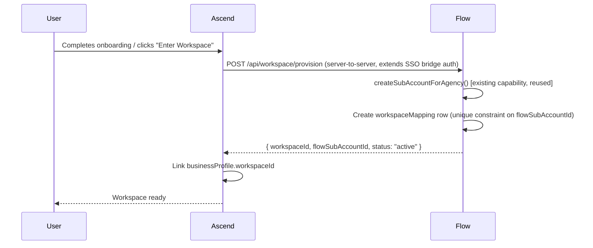

# DivineX Ascend OS — Phase 1 Implementation Blueprint
### Architecture Lock & Final Engineering Reference

**Status:** Final planning phase. No further architecture phase is anticipated after this document. Engineering may begin Phase 2 (Section 11) once this is approved.

**Relationship to Phase 0:** this document does not repeat repository verification — see `ASCEND_OS_V1_ARCHITECTURE_SPECIFICATION.md` (same folder) for all verified repository findings, the full SSO bridge documentation, the real design-token inventory, the real RBAC/data-model inventory, and the real capability registry. Every section below **cross-references** that document by section number rather than restating it. Phase 0 findings are assumed correct throughout; any place this document found a direct contradiction is called out explicitly.

**Evidence key:** ✅ VERIFIED (confirmed in Phase 0 or directly during this pass) · 🔒 LOCKED (approved, not open for debate) · 🟡 RECOMMENDATION (this document's decisive call — implementation-ready, not yet built) · ❓ OPEN (genuinely unresolved, named explicitly, never blurred into a recommendation)

**Locked decisions carried in from the Phase 1 prompt** (restated once, referenced by number throughout): (1) Next.js shell is permanent · (2) Ascend Intelligence remains the intelligence service · (3) Flow remains the execution engine · (4) Business Memory stays inside Ascend · (5) Flow owns CRM data · (6) Ascend owns intelligence · (7) no iframe architecture · (8) one product experience · (9) the SSO bridge exists and is not being redesigned · (10) this is the final planning phase.

---

## 1. Workspace Architecture

### 1.1 Canonical model (🔒, cross-ref Phase 0 §1 Decision 3, §2)

A **Workspace** is the customer-facing name for a Flow `SubAccount`. One workspace ↔ one `flowSubAccountId` (1:1, DB-constrained). One workspace ↔ 1 primary + N secondary `ascendBusinessProfileId`s. The migration source is the real `divinex_workspace_mappings` table (Phase 0 §0.1) — this is a generalization of existing rows, not a green-field table.

### 1.2 Ownership

`ownerUserId` resolves against the identity authority decided in Section 2 (Firebase). Agency-owned workspaces additionally carry `agencyId`; an agency owner's access to every workspace under their agency is the **existing** Flow claim-based shortcut (`agencyRole === "owner" && agencyId matches`, zero extra Firestore reads — verified real in Flow's `require-tenancy.ts`) — reused as-is, not reinvented.

### 1.3 Provisioning (🟡, concrete sequence)

Provisioning is **lazy and JIT**, matching the existing SSO bridge's own proven pattern (Phase 0 §0.1 Phase 4) rather than a new eager-provisioning flow:



Steps 2–3 reuse `createSubAccountForAgency()` — a **real, already-shipped** Flow capability (confirmed in the `capabilities.ts` import list, Phase 0 §0.3) — so "provision a Flow workspace" is not new backend work on the Flow side, only the wrapping mapping-table logic is new. Idempotent: retrying with the same `ascendBusinessProfileId` returns the existing mapping rather than creating a duplicate `SubAccount`.

### 1.4 Lifecycle, states, and transitions

Extends the Phase 0 §2 state diagram with concrete triggers and effects:

| Transition | Trigger | Effect |
|---|---|---|
| `pending_provision → in_progress` | User completes onboarding or clicks first "Enter Workspace" | Provisioning sequence (1.3) starts |
| `in_progress → complete → active` | All steps succeed | Workspace usable; entitlements synced (Section 3) |
| `in_progress → partial_failure` | Any step throws | `lastReconciliationResult` records which step; safe to retry (idempotent) |
| `active → suspended` | Entitlement lapse (mirrors Flow's **existing** Client Billing `past_due`/grace/lapsed model, CLAUDE.md's Client Billing v1 section — reused, not reinvented) or manual agency action | UI locks per-domain (same paywall pattern Flow already ships); **no data touched** |
| `suspended → active` | Payment resumes / manual reinstatement | Instant — matches the existing "re-enable resumes instantly" pattern used by every Flow feature gate |
| `active/suspended → archived` | Customer-initiated offboarding | Workspace mapping flips to `archived`; underlying `SubAccount` and `businessProfile` data is **left untouched** — Data Ownership (Phase 0 §7) means the mapping is what's archived, not the domain data itself |
| `archived → active` | Reinstatement within retention window | Reverses the flip; no data restore needed since nothing was deleted |
| `archived → [deleted]` | Retention window expires **or** explicit compliance deletion request | Two-step confirmation, audit-logged, **out of scope for this document's tables** — deletion of the underlying `SubAccount`/`businessProfile` follows whatever deletion path each owning system already has (Flow: `DELETE /api/contacts/[id]` pattern generalized; this is Section 11 Phase 2 detail work, not a Phase 1 architecture question) |

### 1.5 Multiple business profiles

Reuses Ascend's **existing** `ActiveProfileContext` business-profile switcher pattern (already built, per the earlier blueprint's finding) rather than a new switcher component. One workspace, N linked profiles; switching profiles never switches workspaces.

### 1.6 Synchronization / conflict handling

Unchanged from Phase 0 §7 (Data Ownership Matrix) — every domain has exactly one direction, no bidirectional sync. Cross-referenced, not restated.

### 1.7 Migration from `divinex_workspace_mappings`

🟡 Concrete script design:

1. Read every row from `divinex_workspace_mappings` (real table, Phase 0 §0.1).
2. For each `clerkUserId`, look up all owned `businessProfiles`. If exactly one exists, it becomes primary. If multiple exist, the most-recently-active one becomes primary (`businessTimelineEvents` gives a real recency signal — reuse, don't invent a new activity log); the rest become secondary.
3. Insert one new `workspaceMappings` row: `flowSubAccountId = leadstackSubAccountId`, `primaryBusinessProfileId` as resolved above, `status` mapped from `connectionStatus`.
4. Enforce the unique constraint on `flowSubAccountId` at insert time — a second migration attempt for the same row is a no-op, not a duplicate.
5. Any row where the mapped `leadstackFirebaseUid` is null (not yet JIT-provisioned) migrates with `provisioningStatus: not_started` — the very next SSO login completes it exactly as it does today.

### 1.8 Edge cases

| Case | Handling |
|---|---|
| Flow `SubAccount` exists with no Ascend mapping at all | **Valid, not an error** — this is a CRM-only customer (Locked Decision "Flow may remain a CRM-only offering"). No workspace-mapping row is created until/unless the customer upgrades. |
| Ascend `businessProfile` exists with no Flow mapping | **Valid** — pre-Ascend-OS customer who never triggered the SSO bridge. Workspace provisioning happens lazily (1.3) on first entry into the unified shell. |
| Two `businessProfiles` both claim primary status during migration | Cannot happen by construction (1.7 step 2 always picks exactly one) — but the migration script must log every multi-profile resolution decision for a human to spot-check, since "most recently active" is a heuristic, not a certainty. |
| A `SubAccount` is deleted on the Flow side while a mapping still references it | The next `verifySsoWorkspaceAccess()`-style check (Phase 0 §0.1, reused as-is) fails closed with `sub_account_not_found` — the existing SSO bridge already handles this exact case today; the generalized mapping reuses the same check. |

---

## 2. Identity Architecture

### 2.1 Final decision (🟡, decisive — supersedes Phase 0 §3's "lean")

**Firebase becomes the unified identity authority for the customer-facing product.** Clerk remains scoped to the legacy Ascend Vite frontend during migration and is never removed outright (Ascend's internal/operator console — Phase 0 §0.3's 9 platform roles — has no reason to move, per the "internal operator consoles remain separate" locked decision).

**Why, decisively:** every verifiable factor in Phase 0 §3 pointed the same direction — Firebase already carries workspace/role/agency claims natively (Clerk carries none), Flow's JIT provisioning is proven and reused wholesale (1.3), and collapsing to one authority **deletes** the 5-phase SSO bridge's *reason to exist* rather than adding a second bridge to maintain. The unverified factors (exact user counts, recovery-flow maturity) are operational due-diligence items for the migration script, not reasons to stay neutral on the architecture.

### 2.2 Account linking

🔒 Never link by email match alone — this is the exact principle the existing SSO bridge already enforces (Phase 0 §0.1: "no email-based account linking… resolved strictly by the explicitly mapped `leadstackFirebaseUid`"). Migration reuses this: a Clerk user is linked to a Firebase user only via an explicit `identityLinks` row (`clerkUserId ↔ firebaseUid`, created once, audited), never by matching on `email` at request time.

### 2.3 Migration mechanics

🟡 Three-stage, zero-downtime:

1. **Backfill** — for every Clerk user with an active entitlement (Phase 0 §0.3's `entitlements` table), run the **same JIT-provisioning code path the SSO bridge already uses** (Phase 0 §0.1, Phase 4) once, server-side, without a live login — creates the Firebase user + `identityLinks` row. This is explicitly *reusing* proven code, not writing new provisioning logic.
2. **Dual-auth period** — the legacy Ascend Vite app keeps using Clerk for its own login (unaffected). The new unified Next.js shell's login screen authenticates directly against Firebase; a Clerk-authenticated user visiting the new shell is silently routed through the existing SSO-bridge-token exchange (Phase 0 §0.1, Phase 5) to obtain a Firebase session — no new sign-in step is added, this is exactly what the bridge already does today for the "Operations" link, just as the default entry path instead of an opt-in click.
3. **Cutover** — once backfill (stage 1) covers 100% of active entitlements and the live SSO test (Phase 0 §0.2) has run clean for a full billing cycle, the legacy Clerk-only Ascend frontend is pointed at the same Firebase-first flow. Clerk is not deleted — see rollback.

### 2.4 Rollback

🟡 Low-risk by construction: Clerk is never disabled during migration, so rollback is "point the shell's login screen back at Clerk-only + SSO-bridge-on-click" — a routing change, not a data-recovery operation. No Firebase data needs to be un-migrated since `identityLinks` rows are additive, not destructive to Clerk's own user records.

### 2.5 OAuth, email changes, password reset

- **OAuth**: Flow's current auth is email/password only (CLAUDE.md's Tech Stack section — ✅ VERIFIED, no OAuth provider configured today). Adding Google/social OAuth via Firebase is **new work**, not a migration of an existing capability — scoped as an optional Phase 6+ enhancement, not a Phase 1 blocker.
- **Email changes / password reset**: Firebase's built-in flows, identical in shape to what Flow's own signup/login already uses (`next-firebase-auth-edge` session cookies) — no new design needed, reuse as-is.

### 2.6 Sessions, refresh, logout

Unchanged — Flow's existing session-cookie infrastructure (`createSessionCookie()`, already reused as-is by the SSO bridge per Phase 0 §0.1) is the final mechanism. No parallel session system is introduced.

### 2.7 Impersonation & support access

❓→🟡 **No existing precedent in either codebase** — this is genuinely new. Recommendation: a platform-role-gated (`platform.admin` only, Phase 0 §0.3's real role) `POST /api/support/impersonate` that mints a **time-boxed** (15 min, non-renewable without re-issuing), explicitly-flagged session — the impersonated session carries an `impersonatedBy` claim, every write during impersonation is tagged with it in the existing audit-log patterns (`ssoAuditEvents`-style, reused shape), and the customer-facing UI shows a persistent, undismissable banner. This is a Phase 5+ build item, not a Phase 2 blocker — flagged here so the identity-claims schema (2.1–2.2) reserves the `impersonatedBy` field now rather than needing a breaking schema change later.

---

## 3. Workspace Permissions

Cross-ref Phase 0 §4 for the full Workspace-role and Platform-role permission tables — **finalized as written there**, not restated here. This section completes the pieces Phase 0 explicitly left as a target model.

### 3.1 Permission evaluation algorithm (🟡)

```
evaluatePermission(ctx, permissionKey):
  if not entitlementAllows(ctx.workspace, permissionKey.domain):   # Section 5, Phase 0 §5
      return DENY  # entitlement gates BEFORE role/permission — Phase 0 §5's explicit rule
  if ctx.callerIsAgencyOwnerOf(ctx.workspace):
      return ALLOW  # existing Flow claim-shortcut, reused (1.2)
  role = lookupWorkspaceRole(ctx.uid, ctx.workspace)   # Flow subAccountMembers doc, existing
  if role is null: return DENY
  return ROLE_PERMISSIONS[role][permissionKey] ?? DENY   # Phase 0 §4 matrix
```

### 3.2 Single source of truth (🟡, resolves Phase 0 Open Decision 11)

One `evaluatePermission()` implementation, **owned by Flow** (since Flow already does real server-side enforcement today — `require-tenancy.ts`, ✅ VERIFIED), imported by every Flow route AND exposed as the one function the Zeno execution bridge (Section 7) calls before any capability executes. This directly closes the RBAC-duplication risk Phase 0 flagged (§12): Ascend's Vite frontend keeps its own independent `permissions.ts` for its **internal operator console only** (locked decision — internal consoles stay separate) — it is never asked to re-implement Workspace-role logic, because Workspace-role logic doesn't exist on the Ascend side at all in the target model.

### 3.3 Feature gates & entitlements

Cross-ref Phase 0 §5 — the composed model (Flow's 11 existing gates + Ascend's `entitlements`/`usageTracking`) is final. New gates follow Flow's **already-documented** 5-step wiring pattern (CLAUDE.md's "Agency feature gates" section) unchanged — no new gate-authoring process is introduced.

### 3.4 Extensibility

Permission keys stay `domain.action` string enums (Phase 0 §4's convention) — adding a new domain (e.g., `documents.*` if Section 9's open Documents builder ships) never requires a schema migration, only a new set of matrix rows and `evaluatePermission()` cases.

---

## 4. Internal APIs

### 4.1 The key simplification (🟡 — read before the contract tables below)

Because Locked Decision 1 makes the Next.js shell **Flow's own application**, most of what the original request frames as "Ascend UI → Flow API → Firestore" is **not a network contract at all** — it's the shell calling Flow's own existing server-side service functions (`lib/server/*-service.ts` — `createContactServerSide`, `createDealServerSide`, `createTaskServerSide`, etc., all ✅ VERIFIED real and already used by `capabilities.ts`) **in-process**, the same way any Next.js Server Component or Route Handler in this repo already does. Contacts, Deals, Pipeline, Tasks, Calendar, Funnels, Websites, Forms, Workflows, Broadcasts, Products, Orders, Team/Members, Agency, Billing — **none of these need a new API contract**. This is the single biggest scope reduction Phase 1 found versus the original 12-contract framing.

**Genuine cross-service contracts are needed only where a real second deployment is on the other end** — Ascend Intelligence (Express/Postgres). Five contracts, fully specified below.

### 4.2 Contract: Identity Exchange (extends the existing SSO bridge — Locked Decision 9, not redesigned)

| Field | Value |
|---|---|
| Purpose | Resolve an Ascend-authenticated user into a Flow session (Section 2.3 stage 2) |
| Owner | Flow (`/api/auth/sso/*`, existing, ✅ VERIFIED — Phase 0 §0.1) |
| Consumer | The unified shell's login flow |
| Auth | Existing 5-phase bridge, unchanged (Locked Decision 9) |
| Authz | `verifySsoWorkspaceAccess()`, existing, reused |
| Payload | Unchanged from Phase 0 §0.1 |
| Errors | Unchanged — existing friendly error-page redirects |
| Retries | N/A — single-use tokens by design |
| Timeouts | 90s auth-code TTL, 30s bridge-token TTL — unchanged |
| Idempotency | Single-use tokens are inherently idempotent-safe (a retry with a consumed token fails, not double-executes) |
| Audit | `sso_audit_events` (Ascend) + `ssoLoginAttempts` (Flow) — existing, unchanged |
| Versioning | None needed — this is Locked Decision 9's "reference it, don't redesign it" |

### 4.3 Contract: Workspace Mapping Lookup / Provision

| Field | Value |
|---|---|
| Purpose | Resolve `ascendBusinessProfileId ↔ workspaceId ↔ flowSubAccountId`; trigger JIT provisioning (1.3) |
| Owner | Flow (new: `POST /api/workspace/provision`, `GET /api/workspace/mapping/:businessProfileId`) |
| Consumer | Ascend Intelligence backend |
| Auth | Extends the existing shared-secret Bearer pattern already proven by `ASCEND_SSO_SHARED_SECRET` (Phase 0 §0.1) — no new secret type introduced |
| Authz | Caller must present a valid Ascend-side `clerkUserId` + the shared secret; Flow re-validates the workspace exists and is active |
| Payload | Request: `{ clerkUserId, businessProfileId, businessProfileName }`. Response: `{ workspaceId, flowSubAccountId, status }` |
| Errors | `404 mapping_not_found` (lookup-only calls), `409 already_provisioned` (idempotent — returns the existing mapping, not an error to the caller), `503 flow_unavailable` |
| Retries | Safe to retry — provisioning is idempotent by the unique constraint (1.3) |
| Timeouts | 10s (matches `createSubAccountForAgency()`'s existing synchronous execution time — no new async job needed for this contract) |
| Idempotency | Enforced at the DB constraint level (1.7), not just application logic — same bar the SSO bridge itself already meets |
| Audit | New `workspaceMappingEvents` collection, same append-only shape as `ssoAuditEvents` |
| Versioning | `x-api-version: 1` header, matching Flow's existing Public API v1 convention (CLAUDE.md) |

### 4.4 Contract: Ascend Intelligence Read API (Assessments, Recommendations, Business Memory, Blueprints, Growth Timeline)

| Field | Value |
|---|---|
| Purpose | The unified shell reads intelligence data to render Identify/Optimize screens (Section 5) |
| Owner | Ascend Intelligence (`api-server`, existing route files — `zeno.ts`, `growthScan.ts`, `adminMemory.ts` — extended with workspace-scoped read variants) |
| Consumer | Flow/the Next.js shell, server-side only |
| Auth | Shared-secret Bearer, same pattern as 4.2/4.3 |
| Authz | Ascend resolves `workspaceId → businessProfileId` (via 4.3) then applies its **existing** `platform_memory` scope-isolation guarantee (Phase 0 §0.3: "Business A memory is NEVER returned when querying for Business B" — already tested, `intelligenceOrchestrator.test.ts`) |
| Payload | Per-resource, matching Ascend's existing internal response shapes — no new serialization layer invented |
| Errors | `403 workspace_not_authorized`, `404`, `502 upstream_ai_error` (surfaces gracefully, matches Ascend's existing mock-mode fallback philosophy — Phase 0 §0.3) |
| Retries | GET-only, safe to retry with standard backoff |
| Timeouts | 5s for cached/DB reads; long-running AI generation (assessments/blueprints) stays synchronous-with-polling exactly as Ascend's own frontend already does today — not re-architected into a queue for this contract |
| Idempotency | N/A (reads) |
| Audit | Read access itself isn't audited (matches today's behavior); writes triggered from these screens go through 4.4's write variants, which do log to `intelligenceEvents` (existing, ✅ VERIFIED) |
| Versioning | `x-api-version: 1` |

### 4.5 Contract: Home Metrics (composed)

| Field | Value |
|---|---|
| Purpose | Power the Unified Home dashboard (Section 5) |
| Owner | Flow (composition layer — calls 4.4 for intelligence metrics, its own in-process service functions for operational metrics per 4.1) |
| Consumer | The Home screen only |
| Auth | Standard workspace-session auth (no new mechanism) |
| Authz | `evaluatePermission(ctx, "workspace.read")` (3.1) |
| Payload | `{ operational: {...}, intelligence: {...}, composedAt }` — two independently-cacheable blocks, never a single merged blob that fails as a unit |
| Errors | Intelligence-block failure degrades gracefully to a "temporarily unavailable" card — never blocks the operational block from rendering (matches Locked Decision 6's "Flow's operational writes never wait on Ascend availability" applied to reads too) |
| Retries | Client-side, per-block, independent |
| Timeouts | Operational block: sub-second (Firestore). Intelligence block: 3s before falling back |
| Idempotency | N/A (read) |
| Audit | N/A |
| Versioning | N/A — internal composition, not a public contract |

### 4.6 Contract: Zeno Execution Bridge (net-new — see Section 7 for the full pipeline)

| Field | Value |
|---|---|
| Purpose | Let Ascend's Zeno conversation trigger an approved, confirm-gated action |
| Owner | Flow — **`POST /api/zeno/execute`**, a thin wrapper around the **existing, real** `capabilities.ts` registry (Phase 0 §0.3: 30 capabilities, already confirm-gated) |
| Consumer | Ascend Intelligence backend, on behalf of a Zeno conversation |
| Auth | Shared-secret Bearer (4.2 pattern) **plus** the human user's own workspace session context passed through explicitly — never ambient (Phase 0 §9's cross-builder note: "must pass Workspace ID and role explicitly, never rely on ambient session state") |
| Authz | `evaluatePermission(ctx, capability.requiredRole)` (3.1/3.2) — the **same** check Flow's own in-app AI Suite chat UI already applies, not a parallel weaker check for the cross-service caller |
| Payload | Request: `{ workspaceId, uid, capabilityName, args, confirmationToken }`. Response: matches the existing `ExecuteResult` shape from `capabilities.ts` |
| Errors | `403 permission_denied`, `422 validation_failed` (the capability's own `validate()`, re-run server-side exactly as the in-app chat already does — "the model's output is never trusted directly," Phase 0 §0.3), `409 confirmation_expired` |
| Retries | **Not safely retryable by default** — most of the 30 registered capabilities are creates. `confirmationToken` is single-use (mirrors the SSO bridge token pattern, 4.2) so a network retry surfaces a clear "already actioned or expired" error rather than double-creating |
| Timeouts | 15s (matches typical Flow write-path latency) |
| Idempotency | Enforced via the single-use `confirmationToken`, not a generic idempotency key — deliberate, since Flow's `capabilities.ts` was designed for a human clicking one confirm button once, and the bridge should not weaken that guarantee for a cross-service caller |
| Audit | Writes to the **existing** `aiSuiteActions` collection (✅ VERIFIED referenced in CLAUDE.md's Client Billing section as prior art), tagged `source: "ascend_zeno"` to distinguish from in-app-chat-triggered executions |
| Versioning | `x-api-version: 1` |

---

## 5. Unified Home

| Card | Origin | Refresh | Cache | Loading state | Offline |
|---|---|---|---|---|---|
| Business Health (composed score) | Both (4.5) | On mount + manual refresh | 60s TTL on the intelligence half; operational half is live | Skeleton, matches Flow's existing empty-state visual language | Shows last-cached value with a staleness badge |
| Growth Score | Ascend (4.4) | 60s TTL | Same | Skeleton | Last-cached + staleness badge |
| Revenue | Flow, in-process (4.1) | Real-time (Firestore `onSnapshot`, **existing pattern**, reused everywhere in Flow) | N/A — live | Skeleton | Standard Firestore offline cache (already built into every Flow screen) |
| Leads (new, this period) | Flow, in-process | Real-time | N/A | Skeleton | Same |
| Pipeline health | Flow, in-process | Real-time | N/A | Skeleton | Same |
| Tasks due today | Flow, in-process | Real-time | N/A | Skeleton | Same |
| Upcoming appointments | Flow, in-process | Real-time | N/A | Skeleton | Same |
| Latest assessment summary | Ascend (4.4) | 60s TTL | Same | Skeleton | Staleness badge |
| Highest-impact opportunity | Ascend (4.4) | 60s TTL | Same | Skeleton | Staleness badge |
| Recommended next action | Ascend + Zeno (4.4 + 4.6 context) | On mount | 5 min TTL (more expensive to compute) | Skeleton | Staleness badge |
| Growth Timeline (recent events) | Composed (4.5) | On mount | 60s | Skeleton | Staleness badge |
| Zeno briefing | Ascend, LLM-generated | On mount, explicit "Refresh" button only (never auto-regenerated — cost control, matches Ascend's existing per-request AI-call cost discipline) | Session-cached | Skeleton with a longer, distinct "thinking" state | Shows last-generated briefing with timestamp |
| Quick actions (lifecycle shortcuts) | Static, client-side | N/A | N/A | N/A | Always available |

**Future widgets**: Connected Intelligence cards (Section 8) slot into this same grid once each connector ships — no Home redesign needed, the grid is additive by construction.

---

## 6. Business Memory

Cross-ref Phase 0 §0.3 for the real, existing `platform_memory` schema (scope/type/status/provenance — already production-quality). This section defines what's genuinely new.

| Aspect | Status | Design |
|---|---|---|
| Lifecycle (pending→approved/rejected/needs_revision) | ✅ VERIFIED, existing | Reused as-is |
| Approval | ✅ VERIFIED, existing (auto-approved for scan/audit write-backs, admin-gated for others) | Zeno-execution receipts (4.6) enter as `pending` by default, not auto-approved — a Zeno-initiated write is treated as lower-trust than a deterministic scan write-back until a human confirms once |
| Versioning | ❓ **Not found in Phase 0** — `platform_memory` has no version history today (only `calibrationRules` has `supersedesId`) | 🟡 **New**: add `supersedesId` to `platform_memory` mirroring the pattern already proven on `calibrationRules` — reuse the existing pattern, don't invent a new one |
| Provenance | ✅ VERIFIED, existing (`sourceModule`, `sourceReferenceId/Type`) | Reused; Zeno-execution receipts add `source: "zeno_execution"` + the `aiSuiteActions` record id as `sourceReferenceId` |
| Retrieval | 🟡 **PARTIALLY VERIFIED — keyword-only today** (Phase 0 §0.3's Zeno-engine agent confirmed zero vector/embedding search anywhere) | 🟡 **New, recommended**: add `pgvector` to Ascend's existing Postgres (no new database), embed via the **existing** centralized `aiCall()`/provider layer (Phase 0 §0.3 — already supports both providers), backfill embeddings for existing Knowledge Vault docs + `platform_memory` rows in a background job. This is real new work, explicitly not a migration of something that already exists — flagged 🟡 not ✅. |
| Relationships | ❓ Not modeled today | 🟡 **New**: typed edges (`supersedes`, `relatedTo`, `contradicts`) reusing the conflict-detection logic already proven on `recommendationPatterns` (Phase 0 §0.3) rather than a new detector |
| Corrections | ✅ VERIFIED, existing pipeline (`auditReviews → correctionSummary → calibrationRules`) | Reused as the template for general memory corrections — no new correction UI/flow invented |
| Expiration | ❓ Not modeled today | 🟡 **New**: a `staleAfter` timestamp on scan-derived entries (recommend 90 days), surfaced as a re-verify prompt, not silent deletion |
| Future multimodal | 🟡 Foundation exists | Ascend's vision input (base64 images, already working for Zeno chat + `visionAudit.ts`, Phase 0 §0.3) is the extension point — storing an image reference on a `platform_memory` row is additive to the existing schema, not a redesign |

---

## 7. Unified Zeno — Execution Pipeline

```mermaid
flowchart LR
    A[User message] --> B[Ascend Zeno: reasoning + context assembly\nexisting buildIntelligenceContext/buildBusinessIntelligenceContext, reused]
    B --> C{Action-shaped?}
    C -->|No| D[Advisory reply, unchanged]
    C -->|Yes| E[Structured action-proposal\nmarker pattern, mirrors Flow's existing\nweb-chat [[capture]]/[[form]] markers]
    E --> F[Confirm card shown to user\nreuses Flow's existing AI Suite confirm-card UX]
    F -->|Approve| G[POST /api/zeno/execute — Section 4.6]
    G --> H[evaluatePermission — Section 3.1/3.2]
    H --> I[capability.validate\uxa0then\uxa0capability.execute\nexisting capabilities.ts, unchanged]
    I --> J[Receipt written to aiSuiteActions\ntagged source: ascend_zeno]
    J --> K[Receipt copied into platform_memory\nas a pending strategy_note/asset entry]
    K --> L[Reply to user with result]
    F -->|Decline| D
```

| Stage | Design |
|---|---|
| Reasoning | Ascend's existing prompt/context pipeline — unchanged (Locked Decision 2: Ascend remains the intelligence service) |
| Context assembly | Existing `buildIntelligenceContext()`/`buildBusinessIntelligenceContext()` — unchanged |
| Memory retrieval | Existing `retrievePlatformMemory()`, gaining vector search per Section 6 — otherwise unchanged |
| Intent detection ("is this action-shaped?") | 🟡 New, but reuses a **proven pattern rather than inventing one**: Flow's Web Chat already parses `[[capture ...]]`/`[[form ...]]` markers out of free-text LLM output (CLAUDE.md, Lead Capture section) — the same marker technique, applied to action proposals instead of lead-capture, avoids building a second classifier system |
| Execution | Server-to-server call to 4.6, which runs **inside Flow's own process** against the **existing, unmodified** `capabilities.ts` registry — Locked Decision 3 (Flow remains the execution engine) enforced literally, not just in spirit |
| Capability routing | Direct 1:1 mapping onto the real 30 registered capabilities (Phase 0 §0.3) — no new capability schema |
| Confirmation | Reuses Flow's existing confirm-card UX (`summarize()` → user approval → `execute()`) — the same two-step flow already shipped for in-app chat, now also reachable from Ascend-side conversation |
| Receipts | Written to `aiSuiteActions` (existing collection, tagged `source: "ascend_zeno"`) and mirrored into `platform_memory` as `pending` (Section 6) |
| Auditing | `aiSuiteActions` + the workspace-mapping audit trail (4.3) — no third, parallel audit log |
| Rollback | **Not attempted generically.** Most capabilities are creates; a capability may optionally define its own `undo` (e.g., archive the created object) where the underlying domain already supports it, but full transactional rollback across two databases is explicitly out of scope — consistent with the "no uncontrolled bidirectional sync" spirit of Locked Decision 6. The confirm-gate, not rollback, is the real safety mechanism, matching how `capabilities.ts` already treats every write today. |
| Learning | Approved/rejected Zeno executions feed the **existing** calibration pipeline (Phase 0 §0.3) the same way audit reviews already do — no second learning loop |
| Future MCP compatibility | 🟡 **Noted, not built**: `capabilities.ts`'s shape (`name`/`description`/`parameters` JSON-Schema/`execute`) is already structurally close to an MCP tool definition. A future MCP server could wrap the same registry without touching its internals — flagged as a clean future adapter point, explicitly not part of this build |

---

## 8. Connected Intelligence

**Architectural clarification first (🟡, important — avoids a real design mistake):** not every item in this section is a new external OAuth connector. **Email, Calendar, and Stripe signal already exists inside Flow** (Resend sends, booking-page calendar events, BYO-Stripe/Funnel Checkout orders — all ✅ VERIFIED real Flow features per CLAUDE.md). For these three, "Connected Intelligence" means **Flow-owned operational data flowing into Ascend's Business Memory as intelligence signal** via the existing async, one-directional event pattern (Phase 0 §7) — not a second, separate OAuth integration. The remaining six are genuinely new external connectors.

| Connector | Type | Ownership | Sync frequency | Permissions | Storage | Error recovery | Rate limiting |
|---|---|---|---|---|---|---|---|
| Email signal | Flow-sourced (not new OAuth) | Ascend ingests | Async event on send/open, matches Flow's existing webhook-driven patterns | N/A — internal | New Ascend table, namespaced `email_signal` | Best-effort, matches `crmIntegration.ts`'s never-throw philosophy (Phase 0 §0.1) | N/A |
| Calendar signal | Flow-sourced (not new OAuth) | Ascend ingests | Async event on booking created/completed | N/A — internal | `calendar_signal` table | Same | N/A |
| Stripe signal | Flow-sourced (not new OAuth) | Ascend ingests | Async event on order paid | N/A — internal | `revenue_signal` table | Same | N/A |
| GA4 | New external OAuth | Ascend | Daily batch | Read-only scope | `ga4_metrics` table | Exponential backoff + a connector health surface (conceptually mirrors Flow's existing `gitpageStatus` heartbeat pattern, CLAUDE.md) | Respect Google's documented quota; queue via Flow's **existing** QStash infra using the same server-to-server pattern already proven by `crmIntegration.ts`, rather than standing up a second queue system on Ascend |
| Search Console | New external OAuth | Ascend | Daily batch | Read-only scope | `gsc_metrics` table | Same pattern | Same |
| Google Business Profile | New external OAuth | Ascend | Daily batch | Read-only scope | `gbp_metrics` table | Same pattern | Same |
| Google Ads | New external OAuth | Ascend | Daily batch | Read-only scope | `google_ads_metrics` table | Same pattern | Same |
| Meta Ads | New external OAuth | Ascend | Daily batch | Read-only scope; **note** — Flow already has its own separate Meta connection for inbox/Social Planner (CLAUDE.md) with its own `metaConfig` — these are deliberately **not** shared; Ascend's Connected Intelligence Meta Ads scope is read-only Ads reporting, unrelated to Flow's posting/inbox scopes | `meta_ads_metrics` table | Same pattern | Same |
| WordPress | New external, site-level API key or app password (not OAuth) | Ascend | Daily batch | Read-only, per-site credential | `wordpress_signal` table | Same pattern | Per-site, respect target site's own limits |
| Shopify | New external OAuth | Ascend | Webhook-driven (order/product events) + daily reconciliation batch | Read-only scope where Shopify allows | `shopify_signal` table | Same pattern | Shopify's documented webhook retry semantics |

All new connector tables feed into `platform_memory` as `scan_finding`-type entries (existing type enum, Phase 0 §0.3) with `sourceModule` set to the connector name — no new memory-type taxonomy needed.

---

## 9. Builder Strategy

Extends Phase 0 §9's matrix (Funnels/Websites/Forms/Workflows/Email/Automation — unchanged, cross-ref rather than restated) with the items this Phase 1 prompt added:

| Builder | Evidence | Primary strategy | Rationale |
|---|---|---|---|
| Communities | 🟡 PARTIALLY VERIFIED — `capabilities.ts` imports `createGroupServerSide` from `@/lib/server/community-service` (real, confirmed import), but this feature is **not documented anywhere in Flow's CLAUDE.md** | **C** (native manage UI + editor handoff) | Same reasoning as Workflow Builder — CRUD-shaped, not deeply visual. **Flagged for the same documentation-gap pattern Phase 0 found repeatedly (§0.5)** — recommend a CLAUDE.md pass on this feature independent of this migration. |
| Courses | 🟡 PARTIALLY VERIFIED — `createCourseServerSide`/`createLessonServerSide`/`createSectionServerSide`/`updateLessonServerSide`, real imports, same undocumented status | **C** | Same as Communities — bundled in the same service file, treat as one migration unit |
| Documents | ❓ **OPEN** — no evidence of a dedicated "documents" builder found anywhere in Phase 0's inventory or this pass. Flow does have PDF documents (Quotes/Invoices, CLAUDE.md) but that's not a general-purpose document builder. | Not scheduled | Needs product-owner clarification on what "Documents" refers to before any strategy can be assigned — do not guess |
| Media | ❓ **OPEN** — no evidence of a general media-library/upload builder. Flow's existing image handling is explicitly URL-paste-only in the places checked (Social Planner, Funnel Checkout images, CLAUDE.md) | Not scheduled | If pursued, this is confirmed **new work**, not a migration — no existing implementation to wrap or restyle |

---

## 10. Design System — Finalized

Cross-ref Phase 0 §8 for the full real-token inventory (colors, dead classes, gaps found). This section makes the final calls Phase 0 left as an inventory.

| Category | Final decision (🟡) |
|---|---|
| Color | Ascend's existing dark/jade/indigo/cobalt HSL tokens (Phase 0 §8.1), unchanged — already good |
| Typography | **New 8-step scale** replacing the ungoverned arbitrary-px pattern found (Phase 0 §8.2): `11 / 12 / 13 / 14 / 16 / 18 / 24 / 32 / 48px`, chosen to match the dominant observed real-world sizes rather than an arbitrary new scale |
| Spacing | Stock Tailwind spacing scale — unchanged, was never actually a problem (Phase 0 §8) |
| Containers | **New fixed scale**: `content=720px, article=900px, page=1200px, app-shell=1440px` — replaces the near-duplicate cluster (720/900/1100/1200/1500) found in Phase 0 §8.2 |
| Glass system | Formalize the found ad hoc pattern into three tokens: `--glass-1: rgba(255,255,255,0.03)`, `--glass-2: 0.06`, `--glass-3: 0.10`, all paired with the existing `blur(12px)` — and **enforce their use**, retiring the unused `.glass-card`/`.card-glow-*` classes in favor of these (Phase 0 §8.2 found the named classes dead; don't keep two competing systems) |
| Motion | **Do not adopt `framer-motion`** (confirmed unused, Phase 0 §0.5) — formalize the existing Tailwind-utility + `tw-animate-css` approach with three fixed durations (150ms fast / 250ms base / 400ms slow), standard ease-out, and mandatory `prefers-reduced-motion` support (net-new — not addressed anywhere today) |
| Icons | `lucide-react` — already used on both sides, unchanged |
| Accessibility | **New, concrete requirements** (none of these exist today per Phase 0 §8.3): skip-to-content link, a WCAG AA contrast pass before Phase 3 ships, `aria-label` coverage mandated on every icon-only button in new/restyled components |
| Dark mode | `next-themes`, dark-first/default — supersedes Ascend's hand-rolled `ThemeContext` (Phase 0 §1 Decision 4 correction) |
| Future branding | Every color value must be a CSS variable, never a literal hex — a direct, permanent fix for the hardcoded-hex problem Phase 0 found on marketing pages and in the Clerk-appearance overrides (§8.1) |
| Component hierarchy | Three tiers: **primitives** (shadcn/Radix, reused as-is — 61 existing files are a real asset, not a rebuild target) → **composed** (new: `MetricTile`, `ConfirmCard`, `ExecutionProgress`, `RecommendationCard`) → **screen templates** (new: `ListPage`, `DetailPage`, `DashboardPage`) |

---

## 11. Migration Roadmap

Refines Phase 0 §10's phase table into milestone-grade detail. Phase 0 itself is complete; Phase 1 (this document) is complete on approval. Phase 2 onward:

| Phase | Dependencies | Critical path | Rollback | Testing | Exit criteria | Effort | Risk |
|---|---|---|---|---|---|---|---|
| 2 — Identity & Workspace | Phase 1 approval | Yes — blocks everything after | Point login back at Clerk-only (2.4) — low risk | Idempotency + partial-failure tests on the mapping migration (1.7); full live SSO test (Phase 0 §0.2) | Every existing `divinex_workspace_mappings` row has a corresponding `workspaceMappings` row; live SSO test passes clean for one full billing cycle | L (large) | High — tenant isolation is the single highest-severity failure mode in this entire document |
| 3 — Unified Shell | Phase 2 complete | Yes | Feature-flag the new shell off, fall back to existing Flow UI | Visual regression: zero Flow-styled screens reach a flagged-in Full Ascend customer | Shell ships behind a flag; design tokens (Section 10) live | L | High — theme migration completeness |
| 4 — Native Home & Identify | Phase 3 | Partial — Home can ship before all Identify screens | Flag-gated per screen | Business Memory UI ships against real data (not mocked) | Home (Section 5) + Business Memory browse screen live | M | Medium-High — Business Memory UI was never built before (Phase 0 §0.3) |
| 5 — Native high-use ops | Phase 3 | No — parallelizable with Phase 4 | Flag-gated per screen | Feature-parity checklist vs. current Flow screens | Contacts/Pipeline/Tasks/Calendar native, calling in-process functions (4.1) | M | Medium — mostly UI work since 4.1 removes the API-contract risk entirely |
| 6 — Create & Launch | Phase 5 | No | Flag-gated | List/manage screens only — builders still route to Flow's editor | All Create/Launch list screens native | M | Medium — scope discipline (don't rebuild builders here) |
| 7 — Builder transition | Phase 6, Section 9 strategies approved | Yes for Funnels/Websites specifically (highest customer traffic) | Per-builder flag | Each builder's Section 9 strategy verified in staging first | Every scheduled builder (Funnels/Websites/Forms/Workflows/Email/Automation/Communities/Courses) ships via its assigned strategy | XL | High — funnel builder carries live payment code |
| 8 — Unified Zeno | Phase 4 (Business Memory UI) + Section 4.6 contract built | Yes for the customer-facing "one Zeno" promise | Feature-flag execution off, advisory-only fallback | Every execution path requires explicit approval in test; confirm-gate cannot be bypassed | Zeno execution bridge live, receipts flowing into `aiSuiteActions` + `platform_memory` | L | High — confirmation-gate bypass is a standing top-5 risk |
| 9 — Memory & Timeline | Phase 8 | No | N/A — additive | Async event flow verified under a simulated Ascend outage | Vector search live (Section 6); Growth Timeline composed view live | M | Medium |
| 10 — Connected Intelligence | Phase 9 | No | Per-connector flag | Each connector's error-recovery path tested against a simulated provider outage | At least GA4 + GSC live end-to-end | L | Medium-High — six genuinely new external integrations |
| 11 — Unification completion | Phases 3–10 | Yes — the actual "done" milestone | N/A | No path exists for a Full Ascend customer to see Flow branding, verified by a real click-through | Settings consolidated; legacy routes redirect | M | Medium |
| 12 — Optional repo consolidation | Phase 11 | No | N/A | N/A | Product-owner decision gate, not a build | — | N/A |

---

## 12. Risk Register (expanded)

| Risk | Probability | Impact | Owner | Mitigation | Detection | Recovery |
|---|---|---|---|---|---|---|
| Tenant isolation failure in workspace mapping | Low (DB-constrained by design, 1.1) | Critical | Eng lead, Phase 2 | Unique DB constraint on `flowSubAccountId`, fail-closed role checks (reused from the SSO bridge's own proven design) | Automated test suite (1.7) + the SSO bridge's existing audit logs | Immediate workspace suspension + manual reconciliation |
| Confirmation-gate bypass in Zeno execution | Low | Critical | Eng lead, Phase 8 | Single-use `confirmationToken`, server-side re-validation (4.6) — same bar as the existing in-app chat | `aiSuiteActions` audit trail, anomaly review | Revoke the token pattern's signing secret; per-capability kill switch (existing feature-gate pattern) |
| Business Memory UI underestimated | Medium | Medium | Eng lead, Phase 4 | Scoped explicitly as "never built before" in the roadmap (11) rather than assumed straightforward | Sprint velocity tracking against the Phase 4 milestone | Extend Phase 4 timeline; does not block Phase 5 in parallel |
| Funnel/website builder regression | Medium | High (live payment code) | Eng lead, Phase 7 | Native list/manage-UI-only strategy (Section 9) — the risky editor itself is untouched | Staging verification per builder before flag flip | Per-builder flag rollback, instant |
| RBAC drift between Ascend frontend/backend | Medium (already true today, Phase 0 §0.5) | Medium | Eng lead, Phase 2 | Single `evaluatePermission()` owned by Flow (3.2) — Ascend's internal console keeps its own separate system by design, so there's no cross-boundary drift to have | Code review gate on any new permission check | N/A — architecturally prevented, not just mitigated |
| Undocumented integrations recur | Medium-High | Low-Medium per instance | Eng lead, every phase | A standing grep-based env-var audit at the start of every phase (Phase 0 §12's own recommendation) | Phase-start checklist item | Document immediately on discovery, same as Phase 0 did |
| Connected Intelligence rate-limit violations | Medium | Low-Medium | Eng lead, Phase 10 | Route all connector jobs through Flow's existing QStash infra (Section 8) rather than a new queue | Provider-side rate-limit error monitoring | Backoff + queue depth alerting |
| Identity migration user-count/recovery-flow unknowns (Section 2) | Unknown until measured | Medium | Eng lead, Phase 2 | Explicit due-diligence step before Phase 2 starts (query both `users` tables) | N/A — pre-work | Delay Phase 2 start, not architecture rework |
| Trading-module scope left unresolved (Phase 0 Open Decision 10) | High (already unresolved) | Low (doesn't block Phase 2/3) | Product owner | None yet — needs a decision | N/A | Resolve before Phase 3 shell work touches Ascend's navigation |

All other risks carried from Phase 0 §12 unchanged (data sync, duplicate accounts, permission drift beyond RBAC, commerce, false-success reporting, partial execution failure, Business Memory conflicts, performance, cross-service latency, deployment, browser UX inconsistency, design-system drift, existing-customer migration, support burden, observability, future-merge risk).

---

## 13. Architecture Decision Records

### ADR-001: Next.js (Flow) as the permanent customer-facing shell
- **Context**: two independently mature frontends exist (React/Vite/Ascend, Next.js/Flow); one product experience is required (Locked Decision 8).
- **Decision**: Flow's Next.js app is permanent (Locked Decision 1).
- **Alternatives considered**: Ascend's Vite frontend as the shell (rejected — would require rebuilding Flow's mature CRM/commerce UI from scratch); a third new frontend (rejected — violates "reuse existing business logic").
- **Tradeoffs**: Ascend's screens must migrate into Flow's app (real, scoped work — Section 9); Flow's app gains scope it wasn't originally built for.
- **Consequences**: Section 4.1's in-process simplification is a direct, positive consequence of this decision.
- **Future considerations**: if repository consolidation (Phase 0 §10, Phase 12) ever happens, this decision means Ascend's Vite frontend is the one that eventually retires, not Flow's.

### ADR-002: Firebase as the unified identity authority
- **Context**: Section 2.1.
- **Decision**: Firebase, Clerk stays scoped to Ascend's internal operator console.
- **Alternatives considered**: Clerk as primary (rejected — carries no workspace/agency claims natively, would require building that from scratch on the system with less prior art); maintaining both permanently (rejected — the entire SSO bridge exists only because of the two-authority split; keeping both means keeping the bridge as permanent complexity rather than temporary migration scaffolding).
- **Tradeoffs**: a real, multi-stage migration (2.3) is required; some Ascend-side auth conveniences (Clerk's UI components) are not reused for the customer-facing shell.
- **Consequences**: the SSO bridge (Locked Decision 9) becomes migration scaffolding with a defined retirement path, not permanent architecture.
- **Future considerations**: OAuth/social login (2.5) becomes easier to add uniformly once Firebase is the single authority.

### ADR-003: Flow `SubAccount` as canonical Workspace
- **Context**: Phase 0 §0.3 found Flow's tenancy model mature and load-bearing (billing, entitlements, RBAC); Ascend's is flat with no hierarchy.
- **Decision**: Flow's `SubAccount` is the Workspace (Locked Decision 5, Section 1.1).
- **Alternatives considered**: a new third workspace table (rejected — duplicates real, working infrastructure); Ascend's `businessProfile` as canonical (rejected — no membership/billing/entitlement machinery exists there at all).
- **Tradeoffs**: Ascend's `businessProfile` becomes a child reference, not a peer.
- **Consequences**: 1.7's migration is additive to real existing data, not a green-field build.
- **Future considerations**: none — this is the least contested decision in the document, fully supported by Phase 0 evidence.

### ADR-004: No iframe architecture — native screens over existing APIs
- **Context**: Locked Decision 7.
- **Decision**: complex builders get an explicit per-builder transition strategy (Section 9); iframe is a short-lived internal fallback only, never a target.
- **Alternatives considered**: permanent iframe framing (explicitly rejected by the locked decision itself, carried forward unchanged).
- **Tradeoffs**: higher near-term engineering cost than framing would have been; funnel/website builders in particular stay on Flow's own editor UI (strategy C) rather than a fully-native Ascend-styled editor, as an accepted, time-boxed exception (Phase 0 §9 cross-builder note).
- **Consequences**: Section 4.1's in-process call pattern is what makes "no iframe" actually cheap for most screens — the two decisions reinforce each other.
- **Future considerations**: strategy-C builders (Funnels, Websites, Workflows, Automation, Communities, Courses) are the natural Phase 12+ native-rebuild candidates if repository consolidation ever happens.

### ADR-005: In-process Flow calls instead of network contracts for Flow-owned domains
- **Context**: Section 4.1 — a direct consequence of ADR-001.
- **Decision**: Contacts/Deals/Pipeline/Tasks/Calendar/Funnels/Websites/Forms/Workflows/Broadcasts/Products/Orders/Team/Agency/Billing are called in-process, not via a new API layer.
- **Alternatives considered**: a full network API layer for every domain, symmetric with the Ascend contracts (rejected — adds latency, versioning burden, and duplicate auth logic for zero benefit once the shell and the API owner are the same process).
- **Tradeoffs**: none identified — this is a straightforward simplification once ADR-001 is accepted, not a tradeoff-laden choice.
- **Consequences**: only 5 genuine cross-service contracts exist in the entire system (4.2–4.6), not 12+.
- **Future considerations**: if the shell is ever split from Flow's backend into separate deployments (not currently planned), these in-process calls would need to become real network contracts at that time — flagged, not designed for now.

### ADR-006: Zeno execution via Flow's existing capability registry, not a new tool system
- **Context**: Locked Decisions 2, 3, 9; Phase 0 §0.3's confirmation that `capabilities.ts` is real, typed, and already confirm-gated.
- **Decision**: the Zeno execution bridge (4.6) is a thin wrapper, not a new execution engine.
- **Alternatives considered**: building a new tool-calling system on the Ascend/Express side (rejected — duplicates real, proven infrastructure, and violates Locked Decision 3 in spirit); giving Ascend's Zeno direct Firestore write access (rejected — bypasses Flow's permission/confirm-gate model entirely, a security regression).
- **Tradeoffs**: Ascend's Zeno can only take actions Flow's registry already supports — expanding action-taking capability means adding to `capabilities.ts`, not building a parallel path.
- **Consequences**: Section 7's entire execution pipeline is architecturally simple because it reuses, rather than reimplements, a working system.
- **Future considerations**: MCP compatibility (Section 7) is a natural next step precisely because this decision kept the registry canonical and singular.

### ADR-007: `next-themes` as the unified theming mechanism
- **Context**: Phase 0 §0.5 found Ascend's own `next-themes` dependency already present but disconnected, and Flow already uses it for real.
- **Decision**: adopt `next-themes` platform-wide (Section 10), retiring Ascend's hand-rolled `ThemeContext`.
- **Alternatives considered**: porting Ascend's `ThemeContext` to the unified shell (this was the original Phase 0-era lean before the `next-themes` finding surfaced — superseded once the finding was made).
- **Tradeoffs**: a small, contained rewrite of Ascend's theme-consuming components (only two real consumers found, Phase 0 §0.5 — `AppShell.tsx`'s toggle and `Settings.tsx`) — low actual cost.
- **Consequences**: Sonner's already-broken theme connection (Phase 0 §0.5) gets fixed as a side effect, not a separate bug-fix task.
- **Future considerations**: none — this is a low-risk, low-cost, well-evidenced decision.

---

## Completion note

Every section above reaches an implementation-ready decision or explicitly names what remains open (Section 9's Documents/Media, Phase 0's Open Decisions 10–11 carried into Section 12). No section is left as an unresolved menu of options. This document, together with the Phase 0 specification it cross-references, is the canonical engineering reference for DivineX Ascend OS going forward — no further architecture phase is anticipated before Phase 2 implementation begins.
